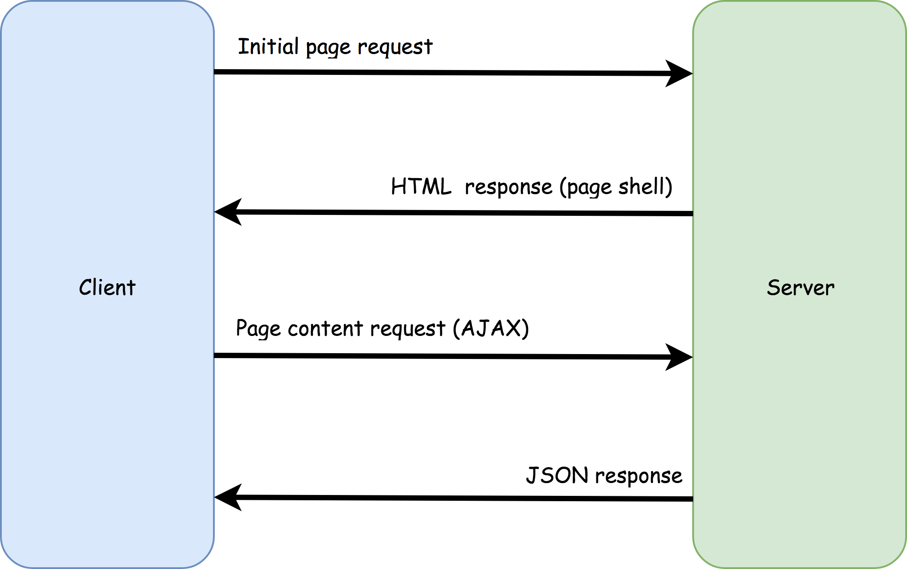
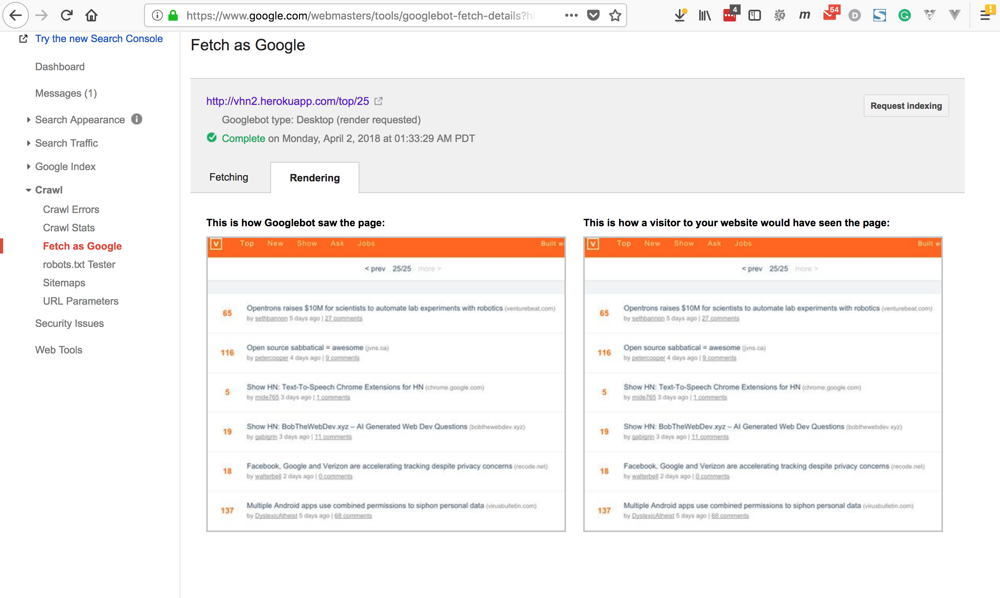
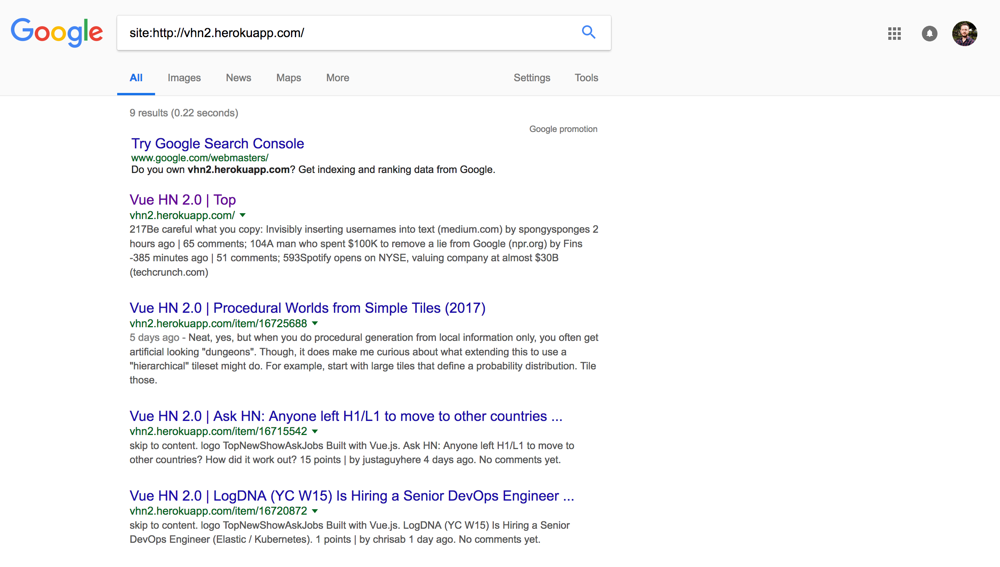

A notoriously murky area of single-page application (SPA) development is SEO. Depending on who you ask, search engine crawling of client-rendered content is either [totally fine](https://flamiszoltan.me/vuejs-laravel-seo), [fine as long as it's synchronous](https://ssr.vuejs.org/en/) or [not at all fine](https://medium.com/@gajus/prerendering-spa-for-seo-and-improved-perceived-page-loading-speed-47075aa16d24).

+Due to the confusion caused by all this conflicting advice, I regularly see the question "is my Vue SPA okay for SEO?" come up in places like the [Vue.js Developers Facebook group](https://www.facebook.com/groups/vuejsdevelopers/search/?query=seo), the [Vue.js Forums](https://forum.vuejs.org/t/vue-js-applications-vs-seo-is-server-side-rendering-really-necessary/5957/6) and [r/vuejs on Reddit](https://www.reddit.com/r/vuejs/search?q=seo).

In this article, we'll challenge the popular opinions, do doing some basic tests and try to conclude with some sensible advice for building SEO-friendly SPAs.

## The issue with client-rendered content

The standard implementation of a single-page app provides a page "shell" to the browser without any meaningful content included. The content is instead loaded on demand from the server with AJAX and then added to the page by JavaScript. 

This allows a user to view the "pages" of an SPA site without a page refresh, theoretically improving UX.

While this architecture works for human users viewing the page in a browser, what about search engine crawlers? Can crawlers run JavaScript? If so, will they wait for the AJAX calls to complete before crawling the page? 

It's important to know this, as it could determine whether or not the site's content is indexable by a search engine, and just as importantly, how well its content is ranked.

> *Note: this article was originally posted [here on the Vue.js Developers blog](https://vuejsdevelopers.com/2018/04/09/single-page-app-seo/?jsdojo_id=cjs_seo) on 2018/04/09*

## Googlebot

Since Google is the [leading search engine](http://gs.statcounter.com/search-engine-market-share) globally, our inquiry should focus on Googlebot, the Google search engine crawler. 

In the early days of the web, Googlebot would only crawl the static HTML provided in a page. It was [announced in 2014](https://webmasters.googleblog.com/2015/10/deprecating-our-ajax-crawling-scheme.html), however, that Googlebot would now attempt to render JavaScript before it began crawling. 

To help debug any issues with rendering a JavaScript-modified page, Google provided webmasters with the [Fetch As Google](https://support.google.com/webmasters/answer/6066468?hl=en?utm_campaign=chrome_series_fetchgoogleweb_111717) tool, which shows a snapshot of what Googlebot sees at a particular URL. 

> One common myth is that Googlebot won't crawl asynchronous JavaScript. [This article](https://medium.com/@l.mugnaini/spa-and-seo-is-googlebot-able-to-render-a-single-page-application-1f74e706ab11) has done a great job of busting it. TLDR; Googlebot will wait at least 20 seconds for asynchronous calls to complete!

## How Googlebot sees an SPA

The quintessential Vue.js SPA example is the [Vue HackerNews Clone 2.0](https://github.com/vuejs/vue-hackernews). This is an open source project provided by the Vue team to demonstrate the full capabilities of Vue and effective design patterns.

I deployed this app to a Heroku instance and ran it through Fetch As Google. In the image below, the screenshot on the left shows how Googlebot saw it, and the screenshot on the right shows how a user would see it. They appear to be identical.

### Removing server-side rendering

One of the key features of the Vue HackerNews Clone 2.0 is server-side rendering (SSR). This means, unlike a more basic SPA, the content for each page is rendered on the server and provided to the browser on each page load, just like it were static HTML.

What we're trying to understand, though, is how Googlebot sees client-rendered content. For this reason, I switched SSR off and ran the test again:

Even with client rendering only, Googlebot had no trouble seeing the content. I also waited a few days to see if Google had indexed the app. It had:

## But wait...

+While this test seems to satisfy any concern about client-rendered content, there are some reasons why you shouldn't have full confidence in it:

1. Like all JavaScript engines, Googlebot will not be infallible and there may be edge cases where it cannot render your page
2. Just because a page can be indexed, doesn't mean it will rank well

### Be skeptical of JavaScript

Googlebot had no issues rendering Vue HackerNews. But we shouldn't conclude it can render all JavaScript so flawlessly. Google's 2014 announcement about JavaScript rendering made it clear that there would be no guarantee, although most developers seem to have overlooked that.

Just like a browser, Googlebot must have a JavaScript engine with a particular subset of implemented web standards and ES features, and its particular idiosyncrasies for how those are implemented. 

According to [this video](https://www.youtube.com/watch?v=RAhYnK0v3rk) from Google developers Addy Osmani and Rob Dodson (released Nov 2017), Googlebot is currently based on Chrome 41. There are a lot of new APIs that have been released since version 41, and if you used any of them, presumably Googlebot would not be able to render and index your page.

You may think this is a trivial issue, as you would need to transpile or polyfill such features for older browsers anyway. The point, though, is that you shouldn't have blind faith in your app being run correctly by every search crawler, just as you wouldn't have blind faith in your app being run correctly by every browser.

### Optimization

Don't forget the "O" in "SEO" stands for "optimization". Being indexed be a search engine is not enough; we want our sites to rank well, too. Fetch As Google tells us how a page is seen, but not how the page compares to the competition.

There's an interesting comment on the article [SEO vs. React: Web Crawlers are Smarter Than You Think](https://medium.freecodecamp.org/seo-vs-react-is-it-neccessary-to-render-react-pages-in-the-backend-74ce5015c0c9) made by SEO expert [Barry Adams](https://twitter.com/badams). On the topic of how search engines rank SPAs [he said](https://medium.com/@badams/another-very-late-response-youre-confusing-googlebot-the-crawler-with-caffeine-google-s-b9ef24d81524):

> "What happens when you use React without server-side rendering is that the crawler halts on the very first page because it can’t see any hyperlinks to follow...It makes the crawl process incredibly slow and inefficient. And that is why websites built on React (and similar JavaScript platforms) perform worse in Google than websites that primarily serve plain HTML to the crawler....plain HTML websites can be crawled very efficiently, newly added and changed content will be crawled and indexed much quicker, and Google is much better able to evaluate the crawl priority of individual pages on such websites."

While he doesn't provide any evidence for this, it does seem to be inline with the philosophy of other ranking determinates like [page speed](https://webmasters.googleblog.com/2010/04/using-site-speed-in-web-search-ranking.html).

## What to do if SEO is critical

The bottom line is, if SEO is critical, you can't rely on your SPA's client rendering and must ensure content comes included in your pages. 

This doesn't mean you need to abandon the SPA architecture, though. There are two techniques, server-side rendering and prerendering, that both can achieve the desired outcome.

### Server-Side Rendering

Server-side rendering (SSR) is where a page is rendered by the web server as part of the server request/response cycle. In the case of Vue.js and other similar frameworks, this is done by executing the app against a virtual DOM. 

The state of the virtual DOM is converted to an HTML string, then injected into the page before as it is sent to the client. When the page reaches the browser, the JavaScript app will seamlessly mount over the existing content.

SSR guarantees your page will be crawler friendly, as the page content is complete regardless of how, or even if, the crawler runs JavaScript.

SSR has its downsides, though:

- You'll need to design your code to be "universal" i.e. it must work in both in the browser and in a server-based JavaScript environment. This means any code that expects browser APIs and objects like `window` to be available, will not work.
- Your app will run on each request to the server, adding additional load and slowing responses. Caching can partially alleviate this.
- It's complicated and time-consuming to implement SSR, so you'll need more developer hours for the project.
- It only works well with a Node.js backend. SSR can be done with non-Node backends, for example, by using the PHP extension [v8js](https://github.com/phpv8/v8js), but such solutions are quite limited.

If you're keen to implement server-side rendering in a Vue.js SPA, you should begin with the official guide: [Vue.js Server-Side Rendering Guide](https://ssr.vuejs.org/en/). I've also written a guide on implementing SSR with Laravel and Vue.js: [Server-Side Rendering With Laravel & Vue.js 2.5](https://vuejsdevelopers.com/2017/11/06/vue-js-laravel-server-side-rendering/).

> Tip: frameworks like [Nuxt.js](https://nuxtjs.org/) come with server-side rendering out of the box.

### Prerendering

If you can't use SSR for one of the above reasons, there is another way: prerendering. With this approach, you run the app with a headless browser in your development environment, snapshot the page output, and substitute your HTML files with this snapshot in the server's response.

It’s pretty much the same concept as SSR, except it’s done pre-deployment, not on a live server. It's typically performed with a headless browser like Chrome and can be incorporated into a build flow with Webpack, Gulp etc.

The advantage of prerendering is that it doesn't require a Node.js production server and doesn't add load to your production server.

However, prerendering also has downsides:

- It doesn't work well for pages that display changing data, for example, Vue HackerNews.
- It's not appropriate for pages that have user-specific content e.g. an account page with a user's personal details. However, these kinds of pages are less critical for SEO; you normally wouldn't want an account page indexed anyway.
- You'll need to prerender every route in the app individually, which could take a great amount of time for a large site.

If you're keen to implement prerendering in a Vue.js app, I've written a guide on this blog: [Pre-Render A Vue.js App (With Node Or Laravel)](https://vuejsdevelopers.com/2017/04/01/vue-js-prerendering-node-laravel/)

> Tip: prerendering for SEO can be purchased as a service from [prerender.io](https://prerender.io/)

## Conclusion

Many developers saw Google's 2014 announcement about JavaScript rendering as an end to SEO concerns about SPA content. In fact, there's no guarantee that Googlebot will correctly render a page, and if it does, it still may rank the page lower than static HTML pages in competing sites.

My advice: if you are going to use the SPA architecture, be sure to provide server rendered or prerendered pages.

> *Get the latest Vue.js articles, tutorials and cool projects in your inbox with the [Vue.js Developers Newsletter](https://vuejsdevelopers.com/newsletter/?jsdojo_id=cjs_seo)*
