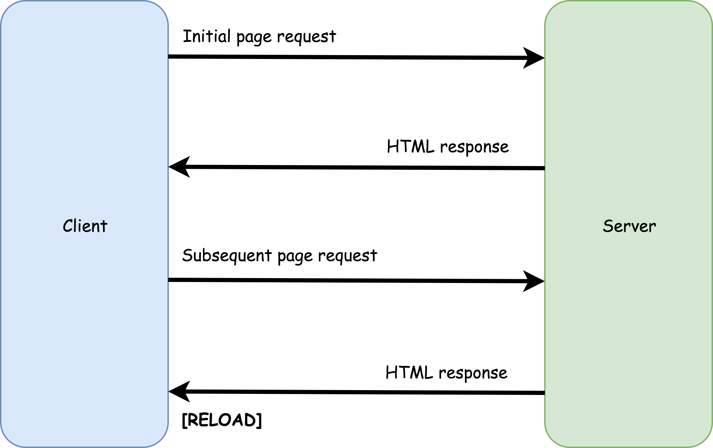
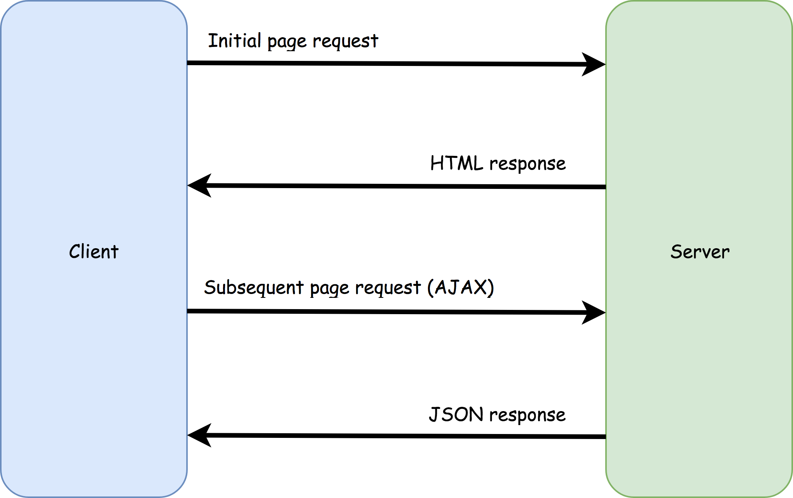

If there were a Hippocratic oath for web developers, it would surely include a promise that any modification to a web page will provide a net improvement to User Experience. 

And yet, there are many sites that have multi-megabyte code bundles, break native browser features like page history or make users wait too long before showing page content. Most often the root cause of these infractions is a poor or unnecessary implementation of the single-page application (SPA) architecture. 

In this article, we'll look at how SPAs are designed and the common pitfalls that detract from user experience.

> *Note: this article was originally posted [here on the Vue.js Developers blog](https://vuejsdevelopers.com/2017/12/18/single-page-application-ux/?jsdojo_id=cjs_spx) on 2017/12/18*

## Single-page application architecture

Most websites are broken up into pages in order to make the information they contain easier to consume. The traditional architecture is to give each page a unique URL. To navigate to a page, the browser sends a GET request to the page's URL. The server will send back the page and the browser will unload the existing page and load the new one.

For the average internet connection, the navigation process will likely take a few seconds, during which the user must wait for the new page to load.

<!--more-->

With JavaScript and web APIs like `XMLHttpRequest`, a different model is possible: the browser can load an initial page, but navigating to new pages will not require the browser to unload the page and load a new one. Instead, the page content can be loaded from an API asynchronously with AJAX and then written into the current page with JavaScript.

From a user's perspective, such a website would appear to have pages just like any other, but from a technical perspective, this site really only has one page. Hence the name, single-page application.

## Routers

A *router* library is the engine of the SPA architecture. It will mimic browser navigation through JavaScript and various web APIs so that the user gets an experience similar to that of a traditional multi-page app.

Routers will typically include functionality to: 

- Handle navigation actions from within the page
- Match parts of the application to URLs 
- Manage the address bar
- Manage the browser history 
- Manage scrollbar behaviour

## Improving UX

The intention of the single-page application architecture is to improve UX, and it does so in the following ways:

1. SPAs can provide **a more continuous experience for the user**, as navigation no longer requires a page refresh. Data for new pages must still be retrieved, and will, therefore, create some small disruption to the user's flow, but this disruption is minimized since the data retrieval can be done asynchronously and JavaScript can continue to run.

2. Once the SPA has loaded, **navigation between pages is quicker** because SPAs will reuse page elements and therefore won't need to keep downloading the same repeated markup. However, a router library will need to be added to your JavaScript bundle, so keep this in mind when doing the accounting.

## Pitfalls

Ironically, single-page applications can harm UX if certain pitfalls aren't avoided:

1. SPAs **break native navigation functionality**. e.g. scroll position, history, back button etc. Once a router has hijacked page navigation, these features may not work as expected. An SPA must restore the functionality with JavaScript and web APIs like `history.pushState`. Most good router libraries will help you do this, but there will still be some manual implementation required.

2. SPAs have **a large initial download size**. Since the router and multi-purpose page elements must be downloaded first for the app to work, SPAs require an upfront download before they run. Build tools like Webpack can help by lazy-loading any code not needed before the first render. 

3. SPAs will need **custom loading states and errors messages**. Browsers give visual cues that a page is being loaded, and a web server can return a 404 page. The result of an AJAX request, on the other hand, is hidden from the user by design. SPAs must find a way to let users know if the app has successfully responded to their actions or not. 

4. With a naive implementation of the SPA architecture, **page content may not be included in the initial page download**, which means a user may have to wait for JavaScript to run and AJAX calls to complete. Server-side rendering or prerendering is a solution to this but often requires a complex setup.

## Conclusion

The purpose of the SPA architecture is to provide superior user experience, but unless proper care is taken, it can have the opposite effect! 

Here are the key things to keep in mind if you choose the SPA archteicture:

- Configure your router software so native navigation features aren't broken
- Employ build tool features like code-splitting and lazy-loading to ensure the initial code bundle isn't too big
- Implement loading states and error messages so that the user knows the page is responding to their actions
- Use prerendering or server-side rendering to ensure your SPA shows content as early as possible

Above all, make sure you have budgeted for the extra work required for building, testing and maintaining an SPA.

> *Get the latest Vue.js articles, tutorials and cool projects in your inbox with the [Vue.js Developers Newsletter](https://vuejsdevelopers.com/newsletter/?jsdojo_id=cjs_spx)*
