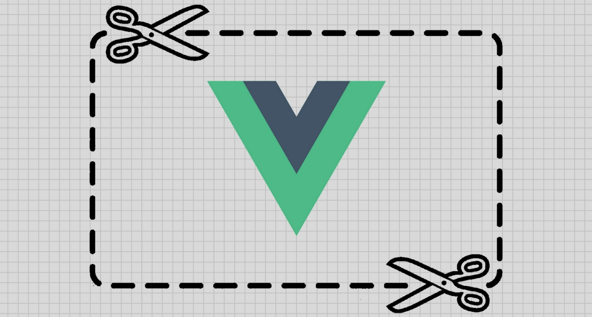
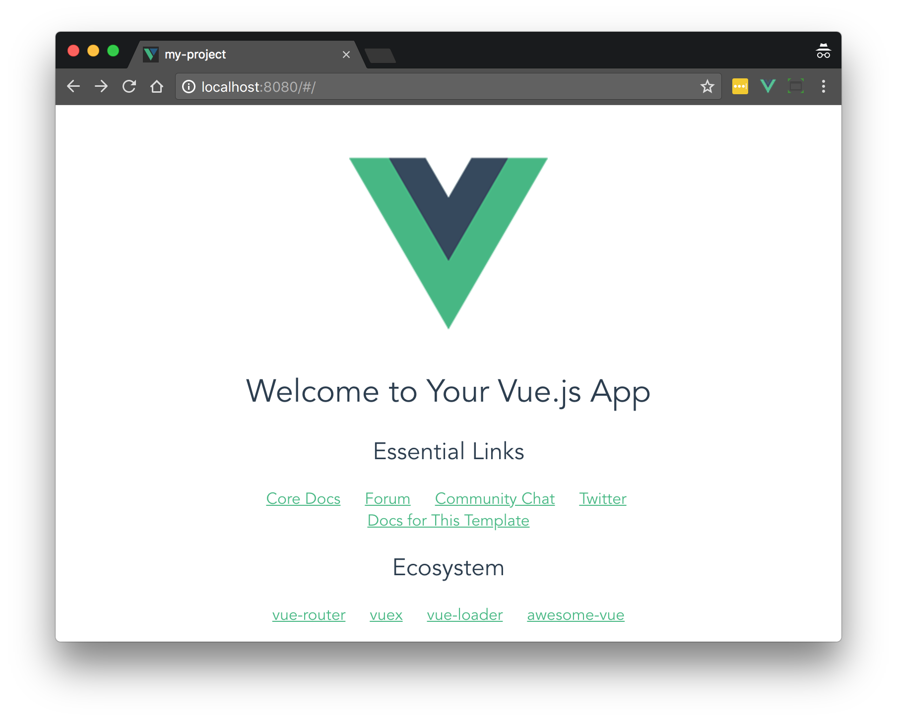
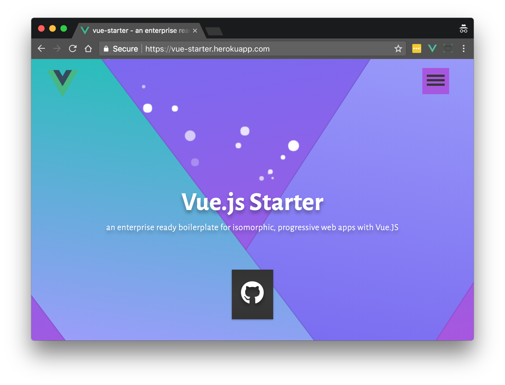
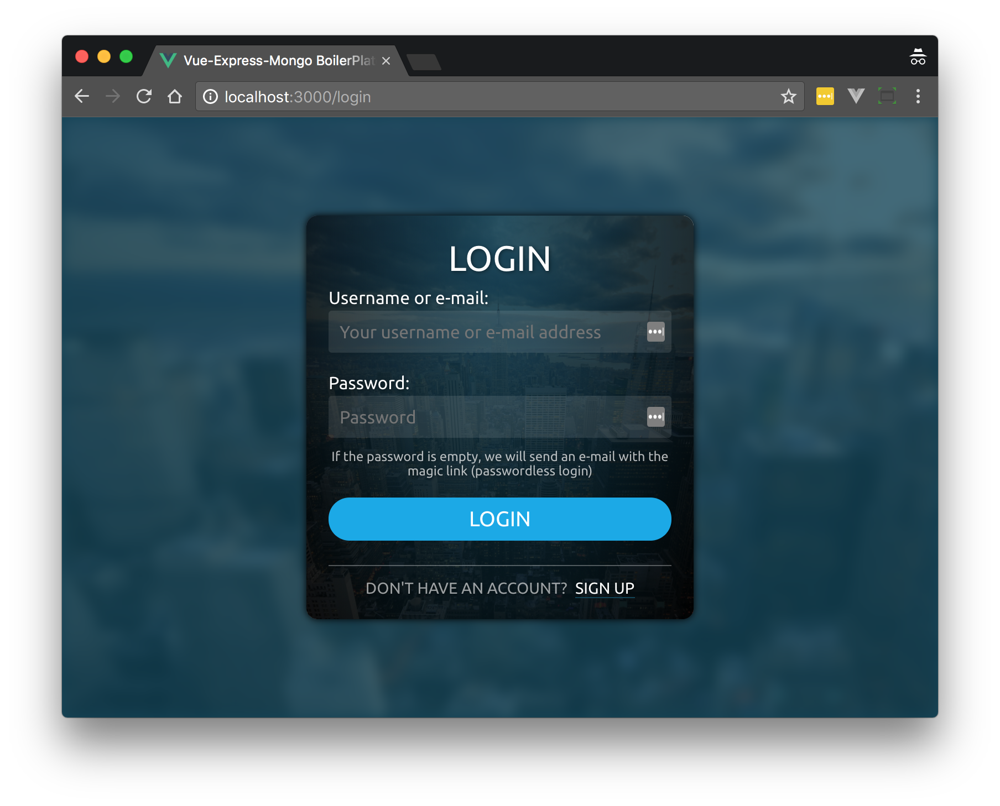
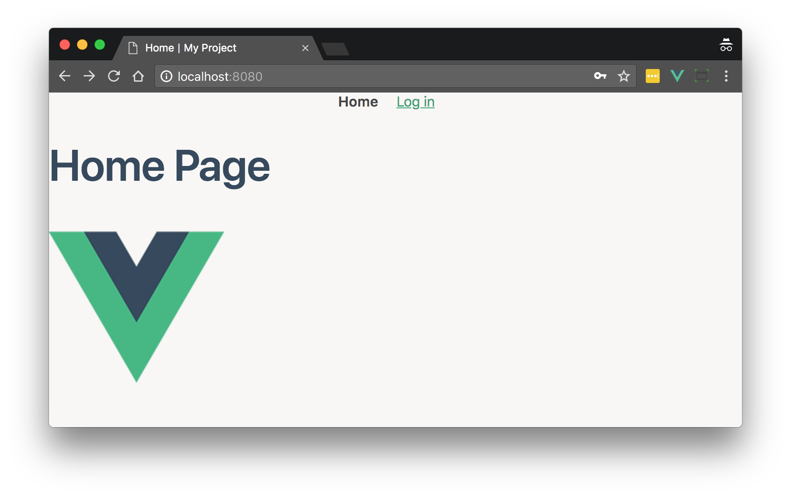
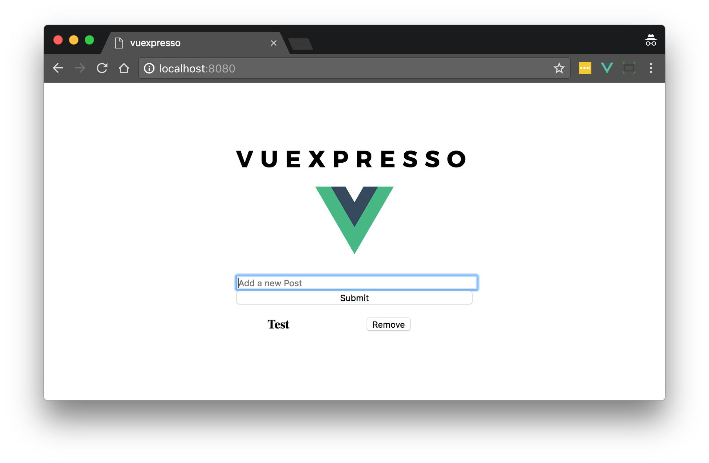

Are you about to begin an important Vue project? To ensure you start with a solid foundation, you might use a template (aka boilerplate, skeleton, starter, or scaffold) rather than starting from `npm init` or `vue init`.

Many experienced developers have captured their wisdom about building high-quality Vue apps in the form of open source templates. These templates include optimal configuration and project structure, the best third-party tools, and other development best practices.

Unlike Vue CLI 3, which is optimized for flexibility, templates are opinionated. It's important, therefore, to choose the one that fits with your development philosophy and has roughly the same features that you'll need out of the box. 

Some considerations for choosing a Vue template include:

- Webpack
- PWA
- Full-stack with authentication
- Good documentation
- GraphQL
- Testing

Etc.

There are many great Vue.js templates out there, but in this article, we'll look at 5 that include key features that new projects will often require.

# 1. Best for Webpack

If you need a solid Webpack setup then look no further than the [Webpack](https://github.com/vuejs-templates/webpack) template included with Vue CLI 2. With almost 7000 stars on GitHub and development and maintenance by Vue team members, this template is your best bet for creating a highly optimized Webpack-powered SPA.

This template leverages many cutting-edge features of Webpack and its ecosystem including hot reload, CSS extraction, linting and of course single-file component loading. It also includes separate configs optimized for development, production, and even testing.

Being part of Vue CLI 2, this is one of the least opinionated templates we'll feature and so  doesn't include many desirable extras like server-side rendering.

If you find the Webpack template a bit of overkill, you can try its little brother, the [Webpack Simple](https://github.com/vuejs-templates/webpack-simple) template.

**Link**: [https://github.com/vuejs-templates/webpack](https://github.com/vuejs-templates/webpack)

> Note: Vue CLI version 3, which is soon to leave beta, has dropped the template architecture in favor of plugins, so this template will technically be deprecated, but will still be available from the legacy settings of Vue CLI 3. Learn more in our article [Vue CLI 3: A Game Changer For Frontend Development](https://vuejsdevelopers.com/2018/03/26/vue-cli-3/).

# 2. Best for PWAs

Do you need the superior UX of a progressive app? [Vue Starter](https://github.com/devCrossNet/vue-starter) is an SPA template for server-rendered PWAs. It includes Vuex and Vue Router configured to work with server-side rendering (SSR) out of the box.

This project has put a lot of thought into ensuring your deployed project has amazing UX right from the beginning, like internationalization for multiple language support and a Lighthouse score of 90+ thanks to SSR and caching with service worker.

Additionally, document head tag management with [vue-meta](https://github.com/declandewet/vue-meta) is used for SEO, while SSR ensures that your page will be indexed by search engines that support JavaScript content.

**Link**: [https://github.com/devCrossNet/vue-starter](https://github.com/devCrossNet/vue-starter)

**Demo**: [https://vue-starter.herokuapp.com](https://vue-starter.herokuapp.com)

> Another nice option if you're building a PWA is [VuePack](https://github.com/egoist/vuepack) and of course, there's the Vue CLI 2 [PWA template](https://github.com/vuejs-templates/pwa).

# 3. Best for Authentication 

If you need user authentication then check out [Vue Express Mongo Boilerplate](https://github.com/icebob/vue-express-mongo-boilerplate). This project provides a full-stack "MEVN" web app boilerplate with out-of-the-box authentication including user signup and social login with Google, Facebook, Twitter and GitHub.

This template follows security best practices by using OAuth 2, Helmet (which adds secure HTTP headers) and Express Validator for input sanitization. It also provides support for several remote logging services.

For the database, MongoDB with Mongoose is provided. The repo also includes Docker config so you can spin up an instance with ease.

**Link**: [https://github.com/icebob/vue-express-mongo-boilerplate](https://github.com/icebob/vue-express-mongo-boilerplate)

**Demo**: [http://vemapp.moleculer.services/](http://vemapp.moleculer.services/)

> Tip: if you'd prefer to use Laravel as a backend for an authenticated Vue app, try [Laravel Vue Boilerplate](https://github.com/alefesouza/laravel-vue-boilerplate) which includes many similar features.

# 4. Best for Documentation

Where many templates fall down is with their lack of documentation. Not so with [Vue Enterprise Boilerplate](https://github.com/chrisvfritz/vue-enterprise-boilerplate). This project is created and maintained by Chris Fritz who wrote much of the Vue documentation, so it is both well organized and consistent with Vue best practices.

The great thing about the documentation for this template is that it explains not only what's included, but often what is not included, and why. For example, Chris explains why there's no TypeScript, Babel polyfills, Pug etc, which are common in other templates. 

Don't let the plain-looking default page of this app fool you, it has plenty of features too. Some of my favorites include mock APIs for testing, and the inclusion of *generators* allowing you to setup components, views and layouts with unit tests automatically added. 

Vue Enterprise Boilerplate also supports Vue CLI 3 so the project could easily be expanded with additional Vue CLI 3 plugins.

**Link**: [https://github.com/chrisvfritz/vue-enterprise-boilerplate](https://github.com/chrisvfritz/vue-enterprise-boilerplate)

# 5. Best for GraphQL

GraphQL is all the rage right now, and many developers want it in their new Vue projects. Not many Vue templates have it though, so if you need GraphQL be sure to check out [Vuexpresso](https://github.com/Ethaan/vuexpresso).

This project uses GraphQL, Apollo and also GraphiQL UI, an in-browser IDE for exploring GraphQL. In addition to these, you get a well-configured Webpack setup, Vuex and Vue Router. You also get Storybook, which allows for interactive development, testing and sharing of UI components. 

The only downside to Vuexpresso is that it is still fairly new, so be sure to have the time to thoroughly test any apps you build with it.

**Link**: [https://github.com/Ethaan/vuexpresso](https://github.com/Ethaan/vuexpresso)

> Another boilerplate with GraphQL support is [Friendly Vue Starter](https://github.com/mcongy/friendly-vue-starter) which also includes critical-path CSS extraction via Critical.
