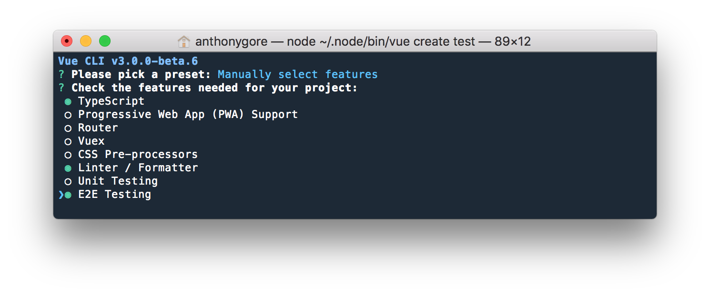

Vue creator Evan You's [recent conference keynote](https://www.youtube.com/watch?v=TRJMT9yjONQ) didn't mention much about new features for Vue, instead focusing almost entirely on Vue CLI 3.

A CLI tool is a mere utility that doesn't directly add any features to your Vue apps, so why the fuss?

The astonishing rise of Vue's popularity over the past year has highlighted what developers really care about in a framework: performance, flexibility, and ease of use.

As you'll see, Vue CLI 3 is a major leap forward in both flexibility and ease of use. It provides your Vue project with instant access to the best build tools from the frontend world, combining them seamlessly with sensible defaults. At the same time, it allows easy configuration and customization to fit your specific needs.

To achieve this, Vue CLI 3 has adopted a new plugin-based architecture, departing from the template-based architecture of versions 1 and 2. Under this new architecture, project configuration is siloed in independent plugins i.e. one for TypeScript, one for ESLint etc. 

Here are some things you'll love about Vue CLI 3:

- No lock in, as plugins can be added at any point in the development lifecycle
- Zero config plugins allow you to spend time developing rather than configuring
- Easy to upgrade, as configuration can be customized without "ejecting"
- Allows developers to make their own plugins and presets

Last, but not least, Vue CLI 3 takes you from a blank canvas to a running server really fast allowing you to prototype a project with nothing more than a single *.vue* file. 

> *Note: this article was originally posted [here on the Vue.js Developers blog](https://vuejsdevelopers.com/2018/03/26/vue-cli-3/?jsdojo_id=cjs_vc3) on 2018/03/26*


## Plugin architecture

The base configuration for a Vue CLI 3 project is bare-bones Webpack and Babel. All the additional features can be added via *plugins* which enhance the project configuration in one or more of the following ways:


- Altering the Webpack configuration (e.g. adding a new loader)
- Altering *package.json* (e.g. adding a script) 
- Altering other files in the project tree (e.g. injecting markup into *index.html*)

Official Vue CLI 3 plugins include Typescript, PWA, Vuex, Vue Router, ESLint, unit testing and more. These plugins, of course, provide best-practice configuration out of the box.

### Installing plugins

Installing a plugin in a Vue CLI 3 project can be done via the interactive prompt that is provided during the project initialization:



However, you can install additional plugins in the project *any time in its lifecycle* with the CLI command `vue add my-plugin`. This means you're not limited to the choices you make at the very beginning of development.

If you have a favorite set of plugin preferences you want to use for every project, say, Vuex, TypeScript, and ESLint with Airbnb config, Vue CLI 3 allows you to save these preference in a locally stored preset file `~/.vuerc`. Now you can spin up perfectly configured projects in an instant!

## Webpack

The elephant in the room of any tooling software is it's handling of Webpack.


You may be relieved when you install your first Vue CLI 3 project and see there is no *webpack.config.js* in the project root. This is because most project configuration for Vue CLI 3 is abstracted into plugins and is merged into the base configuration at runtime.

Tweaking the Webpack config can be done via the new *vue.config.js* file. For example, if you want to add a Webpack plugin (not to be confused with a Vue CLI plugin), drop the necessary code into the *configureWebpack* property. 

*vue.config.js*

```js
module.exports = {
  configureWebpack: {
    // Merged into the final Webpack config
    plugins: [
      new MyAwesomeWebpackPlugin()
    ]
  }
}
```

If you need to get fancier, there are several other APIs provided by Vue CLI 3 for Webpack config, allowing you to directly mutate it, or use the powerful *[webpack-chain](https://neutrino.js.org/webpack-chain.html)*. You can read more about Webpack config in Vue CLI 3 [here](https://github.com/vuejs/vue-cli/blob/dev/docs/webpack.md).

> Note: Webpack config is split among plugins and possibly *vue.config.js*. To see the runtime config, use the command `vue inspect`.

## Custom plugins

Plugins can provide their own configuration options that are specified through the `pluginOptions` property of  *vue.config.js*. For example, if you use [vue-cli-plugin-critical](https://github.com/anthonygore/vue-cli-plugin-critical) for extracting critical CSS, you can specify page `width` and `height` like this:

```js
module.exports = {
  pluginOptions: {
    critical: {
      width: 375,
      height: 565    
    }
  }
}
```

If you want to make more substantial changes to your project configuration, or if you want to repeat the same changes across multiple projects, you can abstract into your own custom plugin. You can then publish this on NPM if you want to share with other developers.

This kind of extensibility was possible with the template-based architecture of Vue CLI 2, as you could simply fork one of the templates and add your changes. However, this system had two serious bottlenecks: 

- Any upstream updates or bug fixes would have to be manually merged into the forked template making it laborious to maintain.
- You're limited to one template per project. What if there are features from several templates you want to includes in a project? You'll end up having to make your own templates with every permutation and combination of features you want, exacerbating the previous problem.

It's for these reasons that third-party Vue CLI 2 templates never really took off. Vue CLI 3 has unequivocally overcome these limitations, so I predict a slew of cool third-party plugins to appear in addition to the official ones.

## No "ejecting"

"Ejecting" is terminology from *Create React App* and refers to a process where all configuration and build dependencies are moved from the scripts folder (think plugins) and placed directly into your project.

This is done to allow direct editing of the configuration. It's a pretty inflexible system, though, as it is irreversible and prevents you from being able to receive upgrades to the scripts, even if you only needed to edit just one.


And herein is the crowning achievement of Vue CLI 3: the flexibility of the plugins and configuration APIs means there is no need to eject a Vue CLI 3 project. As such, Vue CLI 3 projects will remain upgradable throughout their lifecycle.

## Rapid prototyping

If you're like me, sometimes you're struck by such a cool idea that you need to drop everything else and get straight to prototyping it. But if you have to then spend half an hour tinkering with Webpack and Babel config before you can get anything on the screen, it really kills the mood.

Vue CLI 3 makes it incredibly fast to go from zero to served app. It includes a Webpack dev server with hot module reloading and all the other bells and whistles you would expect.

Better yet, if Vue CLI 3 is installed globally, you can serve *.js* or *.vue* files with no local dependencies. This allows you to do something like the following:

```bash
echo '<template><h1>Hello!</h1></template>' > App.vue
vue serve
```

And you'll instantly have a Vue project on the screen.


## Conclusion

What I've covered here are just some of the new features in Vue CLI 3. There are plenty of other tasty treats like:

- Use environment variables in your project through a *.env* file.
- Build a project as a web component for use in any other JavaScript project with the command `vue-cli-service build --target wc --name my-element [entry]`
- *DLL mode* which builds your NPM dependencies into a separate vendor bundle, improving the build time of future builds

And more. Vue CLI 3 is still in beta at the time of writing, but why not get started now by [installing it](https://github.com/vuejs/vue-cli) or [reading the docs](https://github.com/vuejs/vue-cli/blob/dev/docs/README.md).

Thanks to Evan and the team for yet another fantastic tool.


> *Get the latest Vue.js articles, tutorials and cool projects in your inbox with the [Vue.js Developers Newsletter](https://vuejsdevelopers.com/newsletter/?jsdojo_id=cjs_vc3)*
