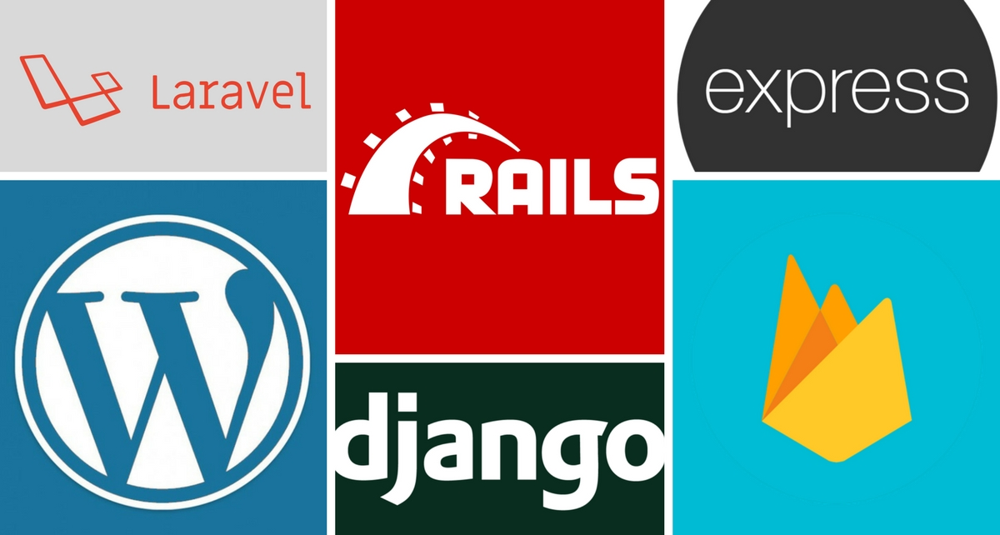

Which backend are you planning to use for your next Vue.js project? 

Often developers choose what they're familiar with. If you're primarily a Laravel developer, for example, I'll bet Laravel will be first to your mind when planning a new project.

It makes sense to work with what you already know and enjoy. That said, each backend has its own strengths and weaknesses, and certain project requirements may better match one more so than others.

Your best bet is to get familiar with what's available so you can make a well-informed choice. In this article, we'll investigate the suitability of some of the most popular backend options for Vue apps:

- [Express](#express)
- [Laravel](#laravel)
- [WordPress](#wordpress)
- [Firebase](#firebase)
- [Serverless](#serverless)
- [Django](#django)
- [Rails](#rails)

> *Note: this article was originally posted [here on the Vue.js Developers blog](https://vuejsdevelopers.com/2018/05/07/vue-js-backends-express-laravel-firebase-wordpress-django-rails/?jsdojo_id=cjs_bbv) on 2018/05/07*

The de facto choice for a Vue.js backend is [Express.js](https://expressjs.com/), a microframework for Node.js.

Before we consider Express specifically, let's first consider the advantages of Node.js. Firstly, Node is written in JavaScript. This means you can share code between a Vue client and a server app. It also means you can use server-side rendering to generate your Vue app on the server and deliver it to the client fully rendered. Secondly, Node is really fast thanks to non-blocking I/O and its great ability to handle concurrent requests.

Express.js is by far the most popular choice for a Node-based framework. Developers like its minimalism, which make it easy to create with and really fast, and its flexibility, allowing you to choose your own database, ORM, authentication etc if you should need them. 

If your goal is to build a web app that is mostly about the frontend and only requires a relatively simple server app to deliver the views and perhaps a basic API, Express is an excellent choice.

> If you like the idea of a JavaScript stack, but want a more substantial MVC architecture, check out [Sails](https://sailsjs.com/). Another good option for building REST APIs with Node is [LoopBack](https://loopback.io/).

### Further reading

- [Full Stack Web App using Vue.js & Express.js (video)](https://www.youtube.com/watch?v=Fa4cRMaTDUI&t=)
- [Build full stack web apps with MEVN Stack](https://medium.com/@anaida07/mevn-stack-application-part-1-3a27b61dcae0)

### Good Vue-based templates for Express

- [vue-express-mongo-boilerplate
](https://github.com/icebob/vue-express-mongo-boilerplate)
- [VueJS + Express + GraphQL Boilerplate](https://github.com/Ethaan/vuexpresso)

[Laravel](https://laravel.com/) is an MVC framework for PHP with the stated goal of "making developers happy". Consistently delivering on this goal is why Laravel has become the most popular backend framework on GitHub.

Since Laravel version 5.3, Vue is the default frontend JavaScript framework that ships in a Laravel installation. The Laravel community unofficially adopted Vue way before it was cool, though, before Vue had even reached version 1.0! In fact, early traction for Vue was partly a result of praise on Twitter from Laravel creator Taylor Otwell.

Vue and Laravel may be written in different languages, but they share a common philosophy: simplicity, elegance and a great user experience. With Laravel, you not only get a powerful object-oriented MVC framework with database, authentication, and API out of the box, you also get a delightful development experience thanks to elegant syntax, sensible default configuration and a community that produces a wealth of great documentation and tutorials.

> If you're just building an API and little else, consider [Lumen](https://lumen.laravel.com/) which is a cut-down version of Laravel designed for creating super-fast microservices.

### Further reading

- [The Ultimate Vue.js & Laravel CRUD Tutorial](https://vuejsdevelopers.com/2018/02/05/vue-laravel-crud/)
- [Single Page App Backends: Where Laravel Beats Node.js](https://vuejsdevelopers.com/2017/06/04/vue-js-backend-laravel-beats-node/)

### Good Vue-based templates for Laravel

- [Single Page Application Starter Kit](https://github.com/codecasts/spa-starter-kit)
- [Laravel Vue Boilerplate](https://github.com/alefesouza/laravel-vue-boilerplate)

[WordPress logo](backends_wordpress.png)

If you're building a content-heavy site, you'll probably need a CMS to allow easy creation and management of your content, especially if non-developers are contributing. The king of CMS is [WordPress](https://wordpress.com/), and, believe it or not, it can pair nicely with Vue.js.

You might think of WordPress as a clunky behemoth with inflexible PHP-generated views. But since version 4.7, WordPress now ships with a REST API, allowing core WordPress data types such as posts, comments, and categories to be accessed straight from a client. This architecture, known as "headless CMS", allows you to take advantage of a powerful CMS backend while still providing a modern user experience with a frontend framework like Vue.

If you need access to more core WordPress functionality than the API can provide, you can instead add Vue to a WordPress theme. Check out [http://vuewordpress.com/](http://vuewordpress.com/) which is stripped-down theme based around a Vue.js single-page app!

> For even more sophisticated content types, consider a headless CMS app using [Drupal REST API](https://www.drupal.org/docs/8/api/restful-web-services-api/restful-web-services-api-overview). Or, if you're building a content-based site but don't need a CMS, consider [VuePress](https://vuepress.vuejs.org/), the recently released Vue-powered static site generator from Evan You.

### Further reading

- [Vuejs Wordpress Theme Starter - Getting Started (video)](https://www.youtube.com/watch?v=dFTsbSRJuIw)
- [Creating a WordPress Theme using the REST API and Vue.js](https://deliciousbrains.com/creating-a-wordpress-theme-using-the-rest-api-and-vue-js/)

### Good Vue-based templates for WordPress

- [vuejs-wordpress-theme-starter](https://github.com/EvanAgee/vuejs-wordpress-theme-starter)
- [WP Vue](https://github.com/alexmacarthur/wp-vue)
- [vue-wordpress-pwa](https://github.com/bstavroulakis/vue-wordpress-pwa)

Firebase provides cloud-hosted data that is accessible from any desktop or mobile app via a simple API. If your data is public, you could even use Firebase as a serverless backend! (more on this in the [next section](#serverless)). 

Where Firebase really shines, though, is in its ability to push data updates to subscribed clients in real time. Real-time data is essential for building chat apps, transport network apps, trading apps and more.

As you may know, Vue's reactivity system allows your UI to respond instantly to changes in JavaScript data. Adding Firebase to update data in real time puts this functionality on steroids: you can have a dynamic interface driven entirely by a remote data source!

Integrating Firebase services with your Vue.js 2 application is dead simple with the [VueFire](https://github.com/vuejs/vuefire) library. This will bind Firebase references to properties on your Vue instances. It can also be done with Vuex via the [VuexFire](https://github.com/posva/vuexfire) library.

> If you don't need a database, another great option for real-time data is [Pusher](https://pusher.com/channels?utm_source=vuejsdevelopers.com&utm_medium=referral&utm_campaign=anthony_gore). Check out the [Ultimate Vue.js 2 Developers Course](https://www.udemy.com/vuejs-2-essentials/?couponCode=VUEJS-BLOG) for an example of a Pusher integration with Vue to keep a shopping cart in sync across multiple tabs.

### Further reading

- [Vue.js 2 + Firebase](https://medium.com/codingthesmartway-com-blog/vue-js-2-firebase-e4b2479e35a8)
- [VueFire - Firebase meets Vue.js (by Evan You)](https://firebase.googleblog.com/2016/04/vuefire-firebase-meets-vuejs_0.html)
- [Vue.js + Firebase Realtime Database - course by Vue School](https://vueschool.io/courses/vuejs-firebase-realtime-database)

### Good Vue-based templates for Firebase

- [vue-firebase-auth-vuex](https://github.com/aofdev/vue-firebase-auth-vuex)
- [vuefire-quickstart](https://github.com/sejr/vuefire-quickstart)

What if I told you you didn't need a backend server at all for your Vue app? Instead, backend functionality could be handled by one or more cloud-hosted scripts that run only as required.

This concept, known as "serverless", means you don't need to pay for a backend server that, for many apps, will spend the vast majority of time idling while it waits for user requests, costing you money for nothing. Serverless functions are far more resource efficient and will often only cost you a matter of cents each month to run. You can then deliver your frontend code from fast and cheap static hosting like [S3](https://aws.amazon.com/s3/), [Netlify](https://www.netlify.com/) or [GitHub Pages](https://pages.github.com/).

Like everything else, serverless is not a silver bullet and realistically is not going to be the right choice for most Vue.js projects. Serverless won't provide a lot of the basics you take for granted on a traditional server, and equivalent functionality requires a lot more development work to achieve with serverless functions.

What serverless it's great for is when you have a small number request/response paths with narrowly defined parameters. Example use cases include handling forms, uploading images or passing data to another service that can't be passed directly from a client app. 

> The major serverless platforms include [AWS](https://aws.amazon.com/serverless/), [Azure](https://azure.microsoft.com/en-us/services/functions/), and [Firebase](https://firebase.google.com/).

### Further reading

- [The Power Of Serverless](https://thepowerofserverless.info/)
- [Creating a Vue.js Serverless Checkout Form](https://css-tricks.com/creating-vue-js-serverless-checkout-part-one/)
- [Serverless Vue.js with GraphQL](https://medium.com/the-web-tub/serverless-vue-js-with-graphql-76a1ba4ceb1e)

If you've learned to program formally, there's a good chance you've been exposed to the powerful Python language. [Django](https://www.djangoproject.com/) is the most popular Python-based MVC framework for web development. 

Django, which promises to be "the web framework for perfectionists with deadlines", follows principles from the Python language that set it apart from other MVCs. For example, the "explicit is better than implicit" principle means it doesn't have the "magic" and "it just works" aspects of Rails or Laravel. Instead, Django code is easy to reason about without domain knowledge of the framework.

Django is a batteries-included and comes with a database, ORM, authentication libraries and a templating engine as part of its core. This makes it a great tool for building powerful and reliable full-stack apps that would pair nicely with a Vue.js client.

> If you're using Python but just need an API for Vue to consume, be sure to consider the [Django Rest Framework](http://www.django-rest-framework.org/) which is a flexible toolkit for building web APIs.

### Further reading

- [Build An App with Django and VueJS](https://scotch.io/bar-talk/build-an-app-with-vuejs-and-django-part-one)
- [Building a CRUD Application with Django Rest Framework and Vue.js](https://www.techiediaries.com/django-rest-vuejs/)
- [Django Vue.js Integration Tutorial](https://github.com/michaelbukachi/django-vuejs-tutorial/wiki/Django-Vue.js-Integration-Tutorial)

### Good Vue-based templates for Django

- [vue-django](https://github.com/NdagiStanley/vue-django)
- [hello-vue-django](https://github.com/rokups/hello-vue-django)
- [cookiecutter-django-vue](https://github.com/vchaptsev/cookiecutter-django-vue)

Rails is an MVC-style framework for the Ruby programming language that has been influential on most of the backends we've covered in this article. It pioneered a "convention over configuration" approach to server frameworks that makes it easy to get started with and results in clean and easy-to-read code. Rails powers many major web applications today like Basecamp, GitHub, and Shopify.

As the documentation says, Rails is "not a minimalist framework, it's a metropolis". This means it includes every conceivable thing you could want in a Vue backend, from ORM to email sending to web sockets. Even Webpack can be run from Rails thanks to the Webpacker Gem, allowing you to have a fully Rails-based development environment for Vue. 

> If you're getting started with Rails and Vue, be sure to check out the [Vuejs Gem](https://github.com/ytbryan/vuejs).

One of Rails' most innovative features, Turbolinks, speeds up navigating between pages by intercepting link clicks that would navigate to a page within the app, and instead makes the request via AJAX, replacing the document body with the received content.

This functionality is mostly handled in Vue apps by Vue Router. However, if Vue is only needed for simple DOM manipulation in a Rails app, i.e. not for a single-page app, you can use Turbolinks via the [vue-turbolinks mixin](https://github.com/jeffreyguenther/vue-turbolinks).

### Further reading

- [VueJS as a Frontend for Rails](https://blog.codeship.com/vuejs-as-a-frontend-for-rails/). 
- [Rails 5 & Vue.js: how to stop worrying and love the frontend](https://mkdev.me/en/posts/rails-5-vue-js-how-to-stop-worrying-and-love-the-frontend)
- [Rails 5.1 API with Vue.js frontend](https://paweljw.github.io/2017/07/rails-5.1-api-with-vue.js-frontend-part-0-stack-choices/)

### Good Vue-based templates for Rails

- [Rails 5.1 + Webpack + Vue.js + Vuex Demo App](https://github.com/gbarillot/rails-vue-demo-app)
- [Todoist clone, written in Rails + Vue](https://github.com/rohitpaulk/todoist-tribute/) (Not a template, but a good example of Vue & Rails)

> *Get the latest Vue.js articles, tutorials and cool projects in your inbox with the [Vue.js Developers Newsletter](https://vuejsdevelopers.com/newsletter/?jsdojo_id=cjs_bbv)*
