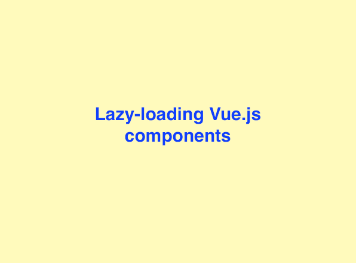
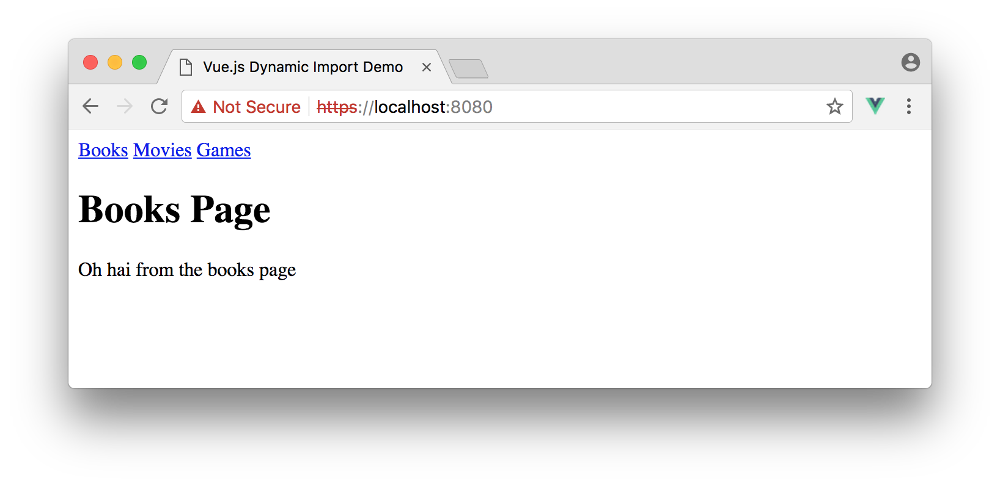
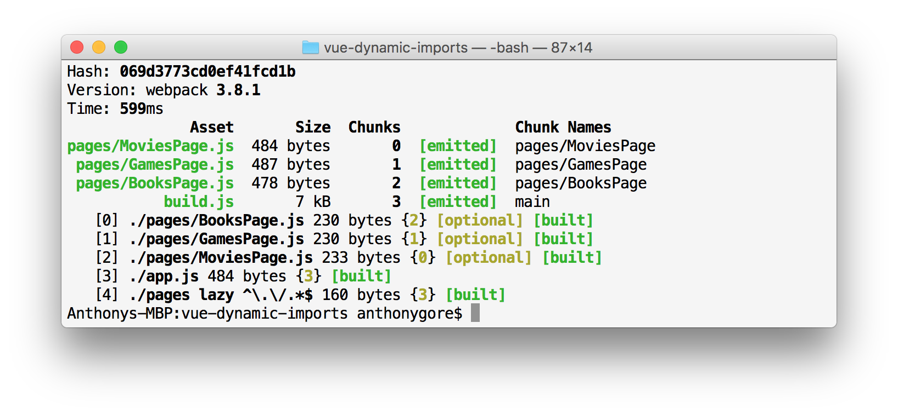

Dynamic module importing is one of the latest JavaScript features to hit the major browsers. The main use case for this feature is lazy-loading modules to allow content to be delivered when it is needed, rather than all at once.

In this article, I'll demonstrate how you can build a lazy-load router with Vue.js in just a few lines of code. This will work natively in browsers that have implemented dynamic module imports, but I'll also include a fallback for older browsers.  



Grab the finished code [here on Github](https://github.com/anthonygore/vue-dynamic-import).

> *Note: this article was originally posted [here on the Vue.js Developers blog](https://vuejsdevelopers.com/2017/10/30/vue-js-dynamic-imports-lazy-load/?jsdojo_id=cjs_llc) on 2017/10/30*

## Static JavaScript module imports

If you're using the latest version of any major browser, you can perform *static* import/export natively now. For Vue.js, this means you can export a component definition from a file like this:

*BooksPage.js*

```js
export default {
  name: 'BooksPage',
  template: `
    <div>
     <h1>Books Page</h1>
     <p>{{ message }}</p>
    </div>
  `,
  data() {
    return {
      message: 'Oh hai from the books page'
    }
  }
};
```

And import it in your app like this:

<!--more-->

*app.js*

```js
import BooksPage from './BooksPage';

new Vue({
  components: {
    BooksPage
  }
});
```

Making components JavaScript modules allows you to organize your app such that every "page" is in a different file. This is nothing new if you use Vue.js single-file components, but with native support now, this architecture can be achieved without Webpack or Babel.

> I cover importing Vue.js components as JavaScript modules more thoroughly in a recent article [Vue.js Single-File JavaScript Components In The Browser](https://vuejsdevelopers.com/2017/09/24/vue-js-single-file-javascript-components/).

## Dynamic JavaScript module imports

If your components represent pages, it'd be better to fetch the module files on demand so that a user doesn't have to download pages they don't visit. Static imports are resolved at *compile time*, however. This means you can't put `import BooksPage from './BooksPage';` inside an `if` statement to conditionally load it. Instead, your static imports will start downloading as soon as the script that loads them runs.

That's where *dynamic imports* come in. These can be determined at *run time*, meaning you can conditionally load a JavaScript module, and therefore pages, on demand. Note that dynamic imports return a Promise which resolves the module content.

```js
import HomePage from './pages/HomePage.js';

Vue.component('my-router', {
  template: '<component :is="page"/>',
  data() {
    return {
      page: HomePage
    }
  },
  methods: {
    navigate(name) {
      this.page = return () => import(`./${name}Page.js`)
    }
  }
});
```

> Note: `component` is a built-in "meta" component that accepts a component definition through the prop `is`. Like all Vue components, this can either be a component definition, or a Promise that resolves the component definition.

This code will work natively in the browser if you're using the latest Safari or Chrome Canary, with other browsers soon to follow.

## Creating a tiny lazy-load router

With that theory in mind, let's make our lazy-load router. In your app template, create some anchor tags where the `href` is the path to the component module for that page. Listen to the click event on these elements, prevent the redirect and instead trigger a method `navigate`.

*index.html*

```html
<div id="app">
  <nav>
    <a href="/pages/BooksPage.js" @click.prevent="navigate">Books</a>
    <a href="/pages/MoviesPage.js" @click.prevent="navigate">Movies</a>
    <a href="/pages/GamesPage.js" @click.prevent="navigate">Games</a>
  </nav>

  <!--Where the page displays-->
  <component :is="page"></component>
</div>
```

We'll define the `navigate` method in the Vue instance and it will accept the click event as an argument. Use the value of the link's `href`, i.e. `event.target.pathname`, to dynamically import the required page component module and assign it to the local `page` state property. This is dynamically bound to the `component` component.

*app.js*

```js
import BooksPage from './pages/BooksPage.js';

new Vue({
  el: '#app',
  data: {
    page: BooksPage
  },
  methods: {
    navigate(event) {
      this.page = () => import(`./${event.target.pathname}`)
      // Vue.js < 2.5.0
      // .then(m => m.default)
      ;
    }
  }
});
```

> Note that versions of Vue.js before 2.5.0 need to include a `then` callback to correctly resolve the module defintion.

That's it! If you run this in a browser that supports dynamic imports you'll see this:



## Fallback

What about users who don't have the latest version of Safari or Chrome? They'll need a fallback. Let's create one with Webpack.

Firstly, we'll have to modify the `navigate` method a bit. Webpack's implementation of `import()` requires it to know ahead of time which files it may need to dynamically load. You don't need to specify the exact module name, just make sure the value you provide to `import()` is a resolvable file or directory.

To do this, we'll change the dynamic file name so it specifies the `pages` directory and extracts the filename from the `href` i.e. \``./pages/${event.target.pathname.split('/').pop()}`\`. At compile-time, Webpack is smart enough to know this means "some file in the *pages* directory" and will process any JavaScript file in this directory.

Secondly, we need to put the comment `/* webpackChunkName: "pages/[request]" */ ` in the function so that Webpack knows to extract this chunk to a separate file. Otherwise, Webpack will bundle all the page component modules in one file and the benefits of lazy-loading will be forfeit.

*app.js*

```js
navigate(event) {
  this.page = () => import(
    /* webpackChunkName: "pages/[request]" */
    `./pages/${event.target.pathname.split('/').pop()}`
  )
}
```

### Webpack config

You can use this simple Webpack config which has two notable features: 

1. Specifies a `chunkFilename` output property. This ensures the page component modules are named correctly in the Webpack output.
1. Transpiles the JavaScript with Babel. You'll need the plugin `syntax-dynamic-import` for Babel to recognise the dynamic import statement.

```js
var path = require('path');
var webpack = require('webpack');

module.exports = {
  entry: './app.js',
  output: {
    path: path.resolve(__dirname, './dist'),
    publicPath: '/dist/',
    filename: 'build.js',
    chunkFilename: '[name].js'
  },
  module: {
    rules: [
      {
        test: /\.js$/,
        loader: 'babel-loader',
        exclude: /node_modules/,
        options: {
          plugins: [require('babel-plugin-syntax-dynamic-import')]
        }
      }
    ]
  }
};
```

Run Webpack with that config and you'll get build files including:

- All the JavaScript module files transpiled to CommonJS modules.
- The main bundle will include Webpack's implementation of dynamic import.



### Checking for dynamic import support

How do you tell the browser to use the fallback? As far as I know, there's no specific way to check for browser support for `import()`. My strategy is to use an inline script in the body of the document which creates a new `script` tag and will conditionally change the source (either the main script or the fallback) depending on support for `import()`. 

```html
<script type="text/javascript">
  var script = document.createElement('script');
  try {
    Function('import("")');
    script.src = "app.js";
    script.type = 'module';
  } catch(e) {
    script.src = "dist/build.js";
    script.type = 'text/javascript';
  }
  document.body.appendChild(script);
</script>
```

Note that the fallback script is treated as a normal JavaScript script, where as the main script is treated as a module.

## Conclusion 

It's great if we can use the native implementations of JavaScript module imports as optimizations like lazy-loading can be done with a smaller file size and much simpler implementation. For example, Webpack's implementation of `import()` requires it to know ahead of time which files it may need to dynamically load, the native implementation does not.

In practice, features like this will need to be progressive enhancements and will, therefore, require Webpack as a fallback, which reintroduces the same complications. Oh well, that's web dev for you.

> *Get the latest Vue.js articles, tutorials and cool projects in your inbox with the [Vue.js Developers Newsletter](https://vuejsdevelopers.com/newsletter/?jsdojo_id=cjs_llc)*
