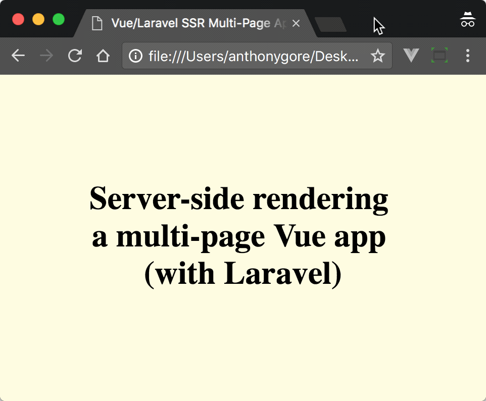
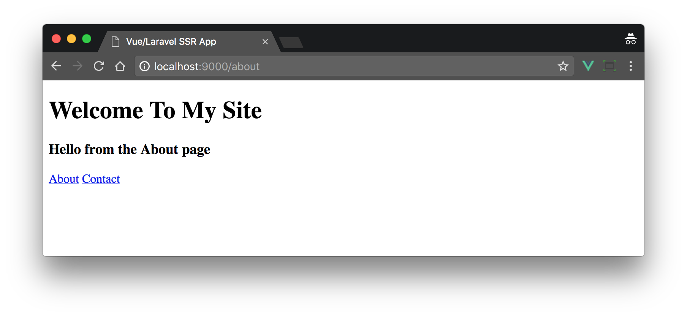
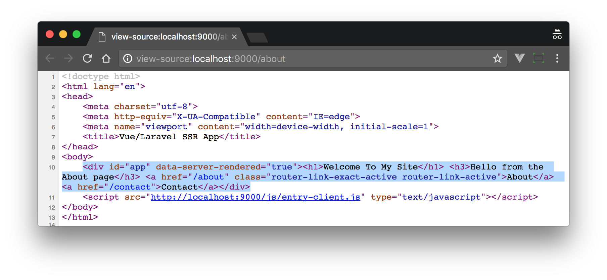

A few weeks ago I wrote a tutorial on the new Vue server-side rendering capabilities for Laravel. That tutorial mostly focused on the set up of SSR in a Laravel environment and so I only had time to demonstrate a simple "Hello World" app with no significant features.

Now I want to build on that previous tutorial and demonstrate how to server render a Vue app that includes multiple pages with Vue Router, since most of your Laravel projects will have more than one page.



You can get the completed code for this tutorial [here on Github](https://github.com/anthonygore/vue-js-laravel-multi-ssr).

> *Note: this article was originally posted [here on the Vue.js Developers blog](https://vuejsdevelopers.com/2017/11/27/vue-js-laravel-server-side-rendering-router/?jsdojo_id=cjs_als) on 2017/11/27*

## Installation

This tutorial will extend the app I built in the previous article, [Server-Side Rendering With Laravel & Vue.js 2.5](https://vuejsdevelopers.com/2017/11/06/vue-js-laravel-server-side-rendering/). Make sure you're familiar with how it works and have a suitable development environment set up i.e. with the php-v8js extension installed.

If you don't have that code, clone it and set it up:

```
$ git clone https://github.com/anthonygore/vue-js-laravel-ssr
$ cd vue-js-laravel-ssr
$ cp .env.example .env
$ composer install
$ npm i
```

Then install Vue Router:

```bash
$ npm i --save-dev vue-router
```

## Router module

We'll begin by creating a file for our router configuration that exports an instance of the router for use in the app.

I've made up some sample routes with each displaying a component generated from the method `pageComponent`. This factory method returns a simple component that does nothing more than display the name of the page. This is all we need to prove SSR routing works.

*resources/assets/js/router.js*

```js
import Vue from 'vue'
import Router from 'vue-router'

Vue.use(Router);

function PageComponent(name) {
 return {
   render: h => h('h3', `Hello from the ${name} page`)
 };
}

export default new Router({
  mode: 'history',
  routes: [
    { path: '/', component: PageComponent('Home'), name: 'home' },
    { path: '/about', component: PageComponent('About'), name: 'about' },
    { path: '/contact', component: PageComponent('Contact'), name: 'contact' }
  ]
});
```

In the main app file we'll now import the router module and add it to the app, just as you would in any Vue project. The app instance is then exported for use in the client and server entry files.

*resources/assets/js/app.js*

```js
import App from './components/App.vue';
import Vue from 'vue';
import router from './router'

export default new Vue({
  router,
  render: h => h(App)
});
```

## Laravel routes

Note that our Vue Router instance is in history mode, so routes will fallback to the server when a sub-page is refreshed or loaded from the navigation bar.

This means that any route that we created in the front-end app also needs to be created on the server side. They can all point to the same controller method `get`:

*routes/web.php*

```php
<?php

Route::get('/', 'AppController@get');
Route::get('/about', 'AppController@get');
Route::get('/contact', 'AppController@get');
```

## Controller

Now we need to set up multi-page SSR in the controller. This is a modification of the logic in the base app, so make sure you're familiar with how that worked.

To SSR a multi-page app, we need to tell the Vue server app (as defined in *entry-server.js*) what the current URL being requested is. This will ensure that when the app loads in the sandbox, it's displaying the correct page component. 

To do this we pass the URL i.e. `$request->path()` through to the `render` method from the `get` method. We then store the URL in a global JavaScript variable `url` that will be accessible from the Vue server app when it runs in the sandbox.

*app/Http/Controllers/AppController.php*

```php
<?php

namespace App\Http\Controllers;

use Illuminate\Http\Request;
use Illuminate\Support\Facades\File;
use Illuminate\Routing\Route;

class AppController extends Controller
{
  private function render($path) {
    $renderer_source = File::get(base_path('node_modules/vue-server-renderer/basic.js'));
    $app_source = File::get(public_path('js/entry-server.js'));

    $v8 = new \V8Js();

    ob_start();

    $js = 
<<<EOT
var process = { env: { VUE_ENV: "server", NODE_ENV: "production" } }; 
this.global = { process: process }; 
var url = "$path";
EOT;

    $v8->executeString($js);
    $v8->executeString($renderer_source);
    $v8->executeString($app_source);

    return ob_get_clean();
  }

  public function get(Request $request) {
    $ssr = $this->render($request->path());
    return view('app', ['ssr' => $ssr]);
  }
}
```

## Vue server app

The last major step is to modify the Vue server app so that we can programmatically set the URL rather than waiting for a user to do it.

The logic for doing this is inside the Promise callback function. Here's what it does:

- The router is set to the correct URL by pushing the global variable `url`
- When the router is ready, we see if any page components are being displayed as a result of this push, telling us the route is valid. If not, we throw a 404. If so, we return the app instance.

A Promise is used because the router loads asynchronously. Once this Promise resolves, we can use the server renderer method `renderVueComponentToString` to SSR the instance and finally use `print` to return the output back to our Laravel environment.

*resources/assets/js/entry-server.js*

```js
import app from './app'
import router from './router';

new Promise((resolve, reject) => {
  router.push(url);
  router.onReady(() => {
    const matchedComponents = router.getMatchedComponents();
    if (!matchedComponents.length) {
      return reject({ code: 404 });
    }
    resolve(app);
  }, reject);
})
  .then(app => {
    renderVueComponentToString(app, (err, res) => {
      print(res);
    });
  })
  .catch((err) => {
    print(err);
  });
```

## App file

The SSR logic for the multi-page app is now complete. Let's create some router links in the page so we can test the app in a browser:

*resources/asset/js/components/App.vue*

```html
<template>
  <div id="app">
    <h1>{{ title }}</h1>
    <router-view></router-view>
    <router-link :to="{ name: 'about' }">About</router-link>
    <router-link :to="{ name: 'contact' }">Contact</router-link>
  </div>
</template>
<script>
  export default {
    data() {
      return {
        title: 'Welcome To My Site'
      }
    }
  }
</script>
```

Loading the home page look like this:



The real test is visiting a route in the navigation bar so the server routes handle the request and hopefully SSR the app. To do so, visit `http://localhost:9000/about` and inspect the source markup. As you can see, it includes the rendered app at the correct URL:



> *Get the latest Vue.js articles, tutorials and cool projects in your inbox with the [Vue.js Developers Newsletter](https://vuejsdevelopers.com/newsletter/?jsdojo_id=cjs_als)*
