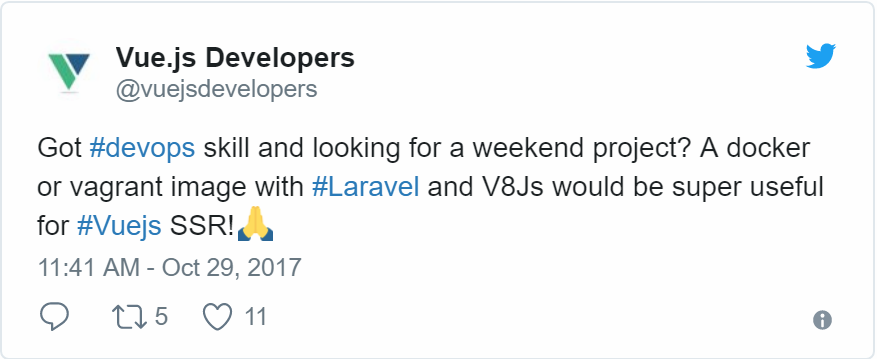
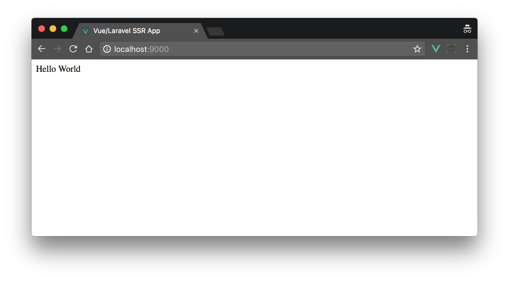
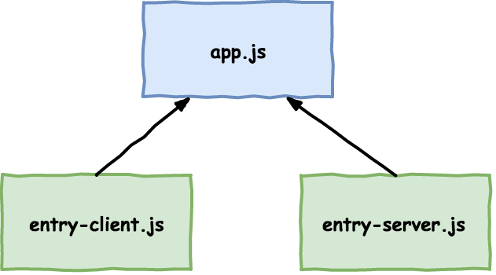
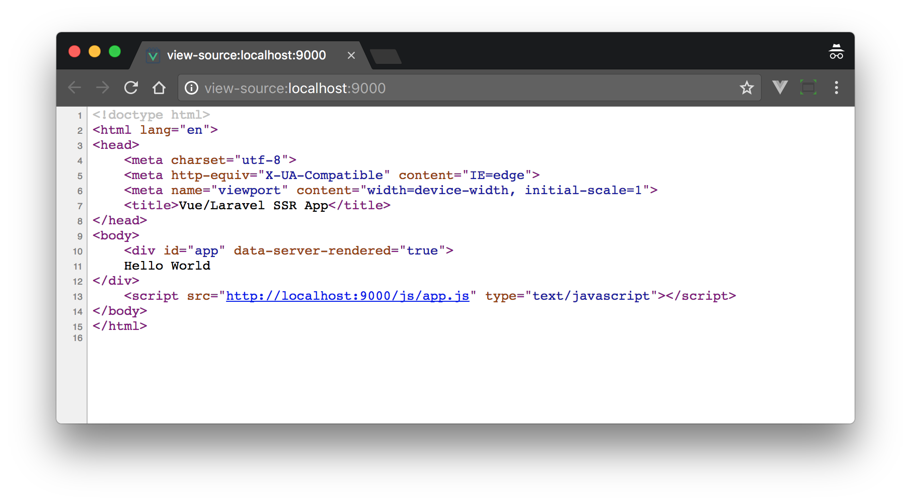

Server-side rendering is great way to increase the perception of loading speed in your full-stack app. Users get a complete page with visible content when they load your site, as opposed to an empty page that doesn't get populated until JavaScript runs.

One of the downsides of using Laravel as a backend for Vue.js was the inability to server render your code. *Was*. The release of Vue.js 2.5.0 has brought server-side rendering support to non-Node.js environments including PHP, Python, Ruby etc.

In this tutorial, I'll take you through the set up steps for Laravel and demonstrate a simple server-rendered app. Get the code for this [here on Github](https://github.com/anthonygore/vue-js-laravel-ssr).

> *Note: this article was originally posted [here on the Vue.js Developers blog](https://vuejsdevelopers.com/2017/11/06/vue-js-laravel-server-side-rendering/?jsdojo_id=cjs_slv) on 2017/11/06*

## Quick overview of server-side rendering

If you aren't familiar with server-side rendering (SSR), here's a simple example: say we have an Vue.js app built with components. If we use the browser dev tools to view the page DOM *after* the page has loaded, we will see our fully rendered app:

```html
<div id="app">
  <ul>
    <li>Component 1</li>
    <li>Component 2</li>
    <li>
      <div>Component 3</div>
    </li>
  </ul>
</div>
```

But if we view the source of the document i.e. *index.html* as it was when sent by the server, you'll see it just has our mount element: 

```html
<div id="app"></div>
```

Why the discrepency? Because JavaScript is responsible for building the page, and ipso facto, JavaScript has to run before the page is built. Fresh off the server, the page will have no content.

But with server-side rendering, our page includes the HTML needed for the browser to build a DOM before JavaScript is downloaded and run, i.e. the page source would look like the first example above. This is achieved by running the Vue.js app on the server and capturing the output, then injecting that output into the page before it is sent to the user.

With SSR, your app does not load or run any faster, indeed it may run slightly slower as the server has the added task of rendering the app. But the page content is shown sooner therefore the user can see engage with page sooner.

## Why couldn't Laravel do Vue SSR until now?

Obviously, SSR requires a JavaScript environment on the server, as a Vue app is made with JavaScript. For non-Node.js backends like PHP, Ruby and Python, a JavaScript sandbox must be spawned from the server to run the Vue app and generate an output.

V8Js is a project that allows you to install the V8 JavaScript runtime within a PHP environment and create such a sandbox. But until Vue version 2.5.0, this was still not adequate as Vue SSR required certain Node.js APIs to run correctly. The recent update has made sure the server renderer is now "environment agnostic" and can therefore be run in Node.js, V8Js, Nashorn etc.

## Vue/Laravel SSR demo

Let's now get a simple demo of Vue SSR in a Laravel app.

### Environment

php-v8js is the PHP extension that will give access to Google's V8 Javascript engine. Undoubtedly the trickiest part of setting up Vue SSR with PHP is getting V8Js installed. Due to my limited Linux knowledge, it in fact took me several hours to get it working.

If you have a bit of skill with dev ops, you might try install it yourself. If not, I recommend you use [this Docker image](https://hub.docker.com/r/doctorlove/docker-php-apache-v8js-node/) and install Laravel on that.



### Installing dependencies

Once you have the extension working and have a fresh Laravel project, you'll need to install both Vue and *vue-server-renderer*. You'll need a minium version of 2.5.0 to get the environment-agnostic SSR features.

```bash
npm i --save-dev vue@>=2.5.0 vue-server-renderer@>=2.5.0
```

### Vue.js

Let's begin by setting up a simple full-stack Vue.js/Laravel app. This won't have any SSR features yet, but we'll be laying the foundations that we'll need. To start, we'll put app's main functionality into a single-file component, *App.vue*.

*resources/assets/js/components/App.vue*


```html
<template>
  <div id="app">
    {{ message }}
  </div>
</template>
<script>
  export default {
    data() {
      return {
        message: 'Hello World'
      }
    }
  }
</script>
```


Our app entry file, *app.js*, will only be responsible for rendering the component and mounting it to the template. Using a render function here instead of a DOM template is essential for reasons that will soon be clear.

*resources/assets/js/app.js*

```js
import App from './components/App.vue';
import Vue from 'vue';

new Vue({
  el: '#app'
  render: h => h(App)
});
```

### Mix configuration

Let's set up a Mix configuration that builds the entry file. Note that I'm also overwriting the default Vue build to use the runtime-only build. Since we're using render functions and single-file components we won't need the template renderer. 

*webpack.mix.js*

```js
let mix = require('laravel-mix');

mix
  .js('resources/assets/js/app.js', 'public/js')
;

mix.webpackConfig({
  resolve: {
    alias: {
      'vue$': 'vue/dist/vue.runtime.common.js'
    }
  }
});
```

With that done, you should be able to build the Vue.js app:

```bash
$ npm run dev

## Outputs to public/js/app.js
```

### Blade view

We'll need a Blade template to deliver our Vue app to the browser. Make sure to include an empty `div` with id `app` which will serve as the mount element. Also, include the build script.

*resources/views/app.blade.php*


```html
<!doctype html>
<html lang="{{ app()->getLocale() }}">
  <head>
    <meta charset="utf-8">
    <meta http-equiv="X-UA-Compatible" content="IE=edge">
    <meta name="viewport" content="width=device-width, initial-scale=1">
    <title>Vue/Laravel SSR App</title>
  </head>
  <body>
    <div id="app"></div>
    <script src="{{ asset('js/app.js') }}" type="text/javascript"></script>
  </body>
</html>
```

#### Controller and route

Let's make a new controller class which will soon include the logic for server rendering the app.

```bash
$ php artisan make:controller AppController
```

To begin with, we'll create a method `get` that will return our app view:

*app/Http/Controllers/AppController.php*

```php
<?php

namespace App\Http\Controllers;

class AppController extends Controller
{
  public function get() {
    return view('app');
  }
}
```

We'll add a web route for the root path which calls this controller method:

*routes/web.php*

```php
Route::get('/', 'AppController@get');
```

With that done, we should now be able to view our humble full-stack app:



### Server-side rendering

The Vue.js app we run in the sandbox must be slightly different to the one we run in the browser, as although the same language is used, these environments are quite different. For example, there is no *window* or *document* object in the sandbox.

We will, therefore need two builds. These will be as similar as possible, but will have some small differences. We'll keep any common (i.e. universal) code in *app.js*, but any environment-specific code will go into the new entry files we'll create shortly.



In *app.js*, let's remove the `el` property from the Vue config as it makes no sense in a server environment since the app has no document to mount to. We'll also make it so this file exports a function which returns a fresh instance of the app which can be imported in our new entry files.

*resources/assets/js/app.js*

```js
export function createApp() {
  return new Vue({
    render: h => h(App)
  });
}
```

### Entry files

We now need to create two new entry files, one for the browser (client) and one for the server.

```bash
$ touch resources/assets/js/entry-client.js resources/assets/js/entry-server.js
```

The client entry will simply re-implement the functionality we just deleted from *app.js* i.e. it will import the universal app and mount it to the template.

*resources/assets/js/entry-client.js*

```js
import { createApp } from './app'

createApp().$mount('#app');
```

The server entry file is a little more interesting. Firstly, it calls a global method `renderVueComponentToString`. This method is exposed by *vue-server-renderer* which we'll introduce into our SSR setup soon. Secondly, it calls a method `print`. This method is part of the V8Js API and is the mechanism for getting something from the JavaScript sandbox back into the PHP environment. 

*resources/assets/js/entry-server.js*

```js
import { createApp } from './app'

renderVueComponentToString(createApp(), (err, res) => {
  print(res);
});
```

We'll now need to update our Mix configuration so that we get a build of each version of the app from the two new entry files:

*webpack.mix.js*

```js
mix
  .js('resources/assets/js/entry-client.js', 'public/js')
  .js('resources/assets/js/entry-server.js', 'public/js')
;
```

After you run `npm run dev` again, you will, of course, have two build files. We'll need to update our Blade view to ensure the new client build file is being loaded instead of *app.js*:

*resoures/views/app.blade.php*


```html
<script src="{{ asset('js/entry-client.js') }}" type="text/javascript"></script>
```


If you refresh the page in the browser you should see no difference in behaviour yet.

### Laravel

We now finally get to the server-side rendering functionality. Add a new method `render` to `AppController` which works like this:

1. The *vue-server-renderer* module and the server build of the app are loaded from the file system.
1. Output buffering is turned on. This means that any output sent from the script is captured internally rather than being printed to the screen.
1. Pass some necessary environment variables to V8Js.
1. The renderer code and the server build file are then executed. Remember that in *entry-server.js* we use the `print` method to output something. This will be captured by the output buffer.
1. Return the buffer contents and delete current output buffer.

*app/Http/Controllers/AppController.php*

```php
<?php

namespace App\Http\Controllers;

use Illuminate\Support\Facades\File;

class AppController extends Controller
{
  private function render() {
    $renderer_source = File::get(base_path('node_modules/vue-server-renderer/basic.js'));
    $app_source = File::get(public_path('js/entry-server.js'));

    $v8 = new \V8Js();

    ob_start();

    $v8->executeString('var process = { env: { VUE_ENV: "server", NODE_ENV: "production" }}; this.global = { process: process };');
    $v8->executeString($renderer_source);
    $v8->executeString($app_source);

    return ob_get_clean();
  }

  public function get() {
    $ssr = $this->render();
    return view('app', ['ssr' => $ssr]);
  }
}
```

The value returned from `render` will be the server-rendered output of our app. It's an HTML string. We'll now assign this to a template variable and send it to the view. Be sure to skip string escaping by using the `{!! !!}` braces so the HTML is printed as-is.

*resoures/views/app.blade.php*


```html
<body>
  {!! $ssr !!}
  <script src="{{ asset('js/entry-client.js') }}" type="text/javascript"></script>
</body>
```


With that, server-side rendering is now working! If you load the app, though, you probably won't notice any difference, as the page loading improvement on a local server is not going to be perceptible. To confirm it works, view the source of the document and you'll see this:



Rather than the empty `<div id="app">`, we have actual content in our page. Note the special attribute that *vue-server-renderer* adds: `data-server-rendered="true"`. This is so that when the Vue instance mounts, rather than trying to re-build the content, it will attempt to mount over it.

## Conclusion

Lack of server-side rendering was one of the biggest cons against using Laravel as a Vue.js backend. It's still is second-rate compared to Node.js since a sandbox is required, but it's great that it now works.

For more information on Vue SSR, check out the [Vue.js Server-Side Rendering Guide](https://ssr.vuejs.org/en/).

> *Get the latest Vue.js articles, tutorials and cool projects in your inbox with the [Vue.js Developers Newsletter](https://vuejsdevelopers.com/newsletter/?jsdojo_id=cjs_vss)*
