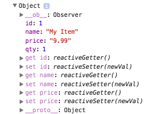

# Reactivity In Vue.js (And Its Pitfalls)

One things we love about Vue is the reactivity system. If we change a data value it triggers an update of the page to reflect that change.

For example:

```js
var app = new Vue({
  el: '#app',
  data: {
    message: "Hello World"
  }
});

setTimeout(function() {
  app.message = "Goodbye World";
}, 2000)
```

```html
<div id="app">
  <!--Renders as "Hello World"...-->
  <!--Then after 2 seconds re-renders as "Goodbye World"-->
  {{ message }}
</div>
```

Data properties, like `message` in this example, are *reactive*, meaning they will trigger a re-render if changed. 

*Note: this article was originally posted [here on the Vue.js Developers blog](	http://vuejsdevelopers.com/2017/03/05/vue-js-reactivity?jsdojo_id=cjs_riv) on 2017/03/05*

## Pitfalls of automatic reactivity configuration

Vue configures reactivity *automatically* whenever you create a data property, computed property, bind a prop etc. This automatic setup is great when coding an app because it:

<!--more-->

- Saves us time
- Makes our code terse 
- Helps minimise our cognitive load

i.e. makes things simple. **But this simplicity can come back to bite us!** The pitfall is that, like an automatic car, automatic reactivity makes us *lazy* and when it doesn't work we have no idea why!

### When good reactivity goes bad

A student in the [Ultimate Vue.js Developers course](https://www.udemy.com/vuejs-2-essentials/?couponCode=VUEJS-BLOG) brought an interesting problem to me the other day. He was working on [Vue.js Poster Shop](http://vuejs-poster-shop.vuejsdevelopers.com/), the first project of the course, which requires you to make a shopping cart using Vue.

A product being displayed in the shop is initially represented like this:

```js
var myProduct = {
  id: 1,
  name: 'My Product',
  price: 9.99
};
```

But when you add a product to the shopping cart you also need to a quantity, which he dealt with in a method like this:

```js
function addToCart(id) {
  var item = this.cart.findById(id);
  if (item) {
    item.qty++;
  } else { 
    item.qty = 1;
    this.cart.push(item);
  }
}

addToCart(myProduct.id);
```

The logic of the method is as follows:

- Find the item in the shopping cart
- If it's there, increase the quantity
- If it's not there, give it a quantity of 1 and add it to the cart

#### A problem appears

The shopping cart template simply displays a list of cart items:

```html
<ul class="shopping-cart">
  <li v-for="item in cart">{{ item.name }} x {{ item.qty }}</li>
  <!-- Renders: myProduct x 1 -->
</ul>
```

The problem was that no matter the value of `qty`, the template always showed its value as "1".

My initial thought was that the logic of the `addToCart` function must be wrong. But after some debugging I discovered that the `qty` property was indeed being increased each time the method was called, so that wasn't the issue...

## How reactivity works under the hood

While causing a mild form of joy in most circumstances, Vue's reactivity system can cause confusion and frustration when it doesn't work like you expect.

This can largely be avoided if you understand *how* it works.

### Getters and setters

The default behaviour for a Javascript object when accessed is to retrieve or modify the property in question directly. For example:

```js
var myObj = {
  a: "Hello World"
};

console.log(myObj.a) // "Hello World"
```

But when `get` and `set` pseudo properties have been defined, these functions override that default behaviour. Read more about [getters](https://developer.mozilla.org/en-US/docs/Web/JavaScript/Reference/Functions/get) and [setters](https://developer.mozilla.org/en-US/docs/Web/JavaScript/Reference/Functions/set) if you don't know what I'm talking about.

When a Vue instance is created, each data property, component prop etc is traversed and getters and setters are added for each. These getters and setters allow Vue to observe changes to the data and trigger updates.

### reactiveSetter()

So, coming back to our product object which looked like this when we defined it:

```js
{
  id: 1,
  name: 'My Item',
  price: 9.99
}
```

After Vue instantiates we can view this object in the console and see the getters and setters that Vue has defined on it:


These getter and setter functions have a number of jobs (check the [source code](https://github.com/vuejs/vue)), but one of the jobs of `rectiveSetter` is to trigger a change notification which results in a page re-render!

### Caveats

This is a brilliant system, albeit a fallible one. If you add (or delete) a property *after* Vue has instantiated (for example in a method or lifecycle hook) *Vue does not know about it*.

```js
// In the addToCart method, called after instantiation
myProduct.qty = 1;
```

Look and see that although `qty` is defined on the object there are no getters/setters for it:



## Updating reactive objects

In the shopping cart example, the way we solved the problem is to create a fresh object when adding to the cart rather than adding a property. That ensures that Vue has the opportunity to define reactive getters and setters:

```js
function addToCart(id) {
  var item = this.cart.findById(id);
  if (item) {
    item.qty++;
  } else { 
    // Don't add a property e.g. item.qty = 1;
    // Instead create a fresh object
    var newItem = {
      id: item.id,
      name: item.name,
      price: item.price,
      qty: 1
    };
    this.cart.push(item);
  }
}

addToCart(myProduct.id);
```

### Vue.set

But if you don't want to create a new object you can use [Vue.set](https://vuejs.org/v2/api/#Vue-set) to set a new object property. This method ensures the property is created as a reactive property and triggers view updates:

```js
function addToCart(id) {
  var item = this.cart.findById(id);
  if (item) {
    item.qty++;
  } else { 
    // Don't add a property directly e.g. item.qty = 1;
    // Use Vue.set to ensure the property is reactive
    Vue.set(item, 'qty', 1);
    this.cart.push(item);
  }
}

addToCart(myProduct.id);
```

## Arrays

Like objects, arrays are reactive and are observed for changes. Also like objects, arrays have caveats for manipulation. Vue wraps array methods like `push`, `splice` etc so they will also trigger view updates.

This is not possible when directly setting an item with the index e.g.

```js
// This array change will not be detected:
app.myArray[index] = newVal;
```

Again, `Vue.set` comes to the rescue:

```js
Vue.set(app.myArray, index, newVal);
```

*Get the latest Vue.js articles, tutorials and cool projects in your inbox with the [Vue.js Developers Newsletter](http://vuejsdevelopers.com/newsletter/?jsdojo_id=cjs_riv)*
