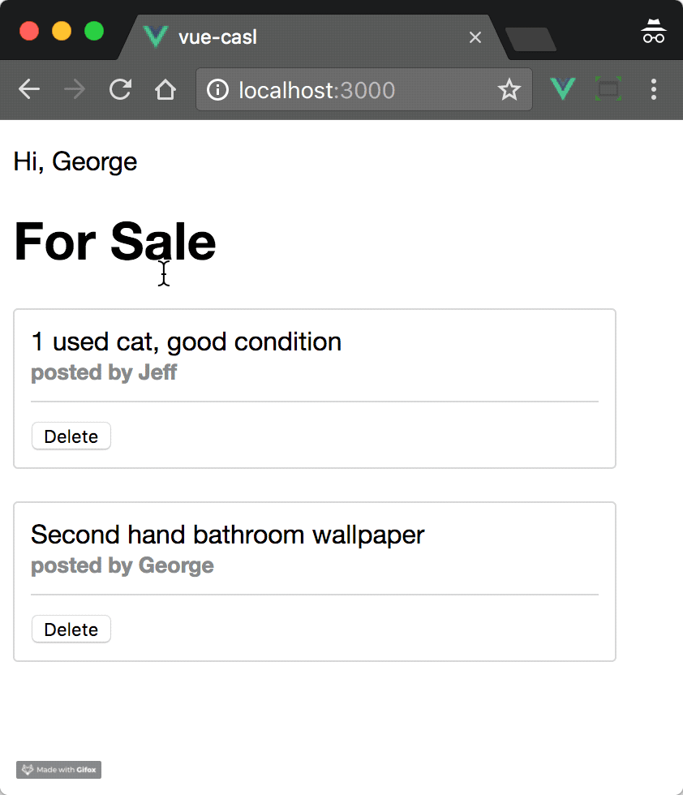

In authenticated frontend apps, we often want to change what's visible to the user depending on their assigned role. For example, a guest user might be able to see a post, but only a registered user or an admin sees a button to edit that post.

Managing permissions in a frontend app can be messy. You may have written code like this before:

```js
if (user.type === ADMIN || user.auth && post.owner === user.id ) {
  ...
}
```

As an alternative, there's a neat little library called *CASL* that helps manage user permissions very simply. Once you've defined your permissions with CASL, and set an active user, you could change the above example to something like this:

```js
if (abilities.can('update', 'Post')) {
  ...
}
```

In this article, I'll demonstrate how to manage permissions in a frontend app with Vue.js and CASL. 



*Note: you don't have to have used CASL before to follow this!*

> *Note: this article was originally posted [here on the Vue.js Developers blog](https://vuejsdevelopers.com/2018/01/08/vue-js-roles-permissions-casl/?jsdojo_id=cjs_vrp) on 2018/01/08*

## CASL crash course

CASL allows you to define a set of rules which restrict what resources a given user is allowed to access.

For example, CASL rules can indicate which CRUD operations (Create, Read, Update and Delete) a user can undertake on a given resource or entity (e.g. a post, a comment, an article etc).

Let's say we have a classified ads website with simple "for sale" posts. An obvious set of rules for this app would be:

- A *guest* user can view any post
- An *admin* user can view any post, and can update or delete a post

In CASL, we use `AbilityBuilder` to define the rules. A new rule is created with a call to `can`, e.g.

```js
const { AbilityBuilder } = require('casl');

export function(type) {
  AbilityBuilder.define(can => {
    switch(type) {
      case 'guest':
        can('read', 'Post');
        break;
      case 'admin':
        can('read', 'Post');
        can(['update', 'delete'], 'Post');
        break;
      // Add more roles here
    }
  }
};
```

Now you can control your app based on checks to the rules you defined, e.g.:

```js
import defineAbilitiesFor from './abilities';

let currentUser = {
  id: 999,
  name: "Julie"
  type: "registered",
};

let abilities = defineAbilitiesFor(currentUser.type);

Vue.component({
  template: `<div v-if="showPost">{{ post }}<div>
             <div v-else>Please log in</div>
            `,
  props: [ 'post' ],
  computed: {
    showPost() {
      return abilities.can('read', 'Post');
    }
  }
});
```

You can find out more about CASL by checking the [official docs](https://stalniy.github.io/casl/).

## Demo project

As a demonstration, I've made a simple server/client app which shows classified ad posts. The permission rules for this app are: a user can read any post or create a new post, but can only update or delete a post if it's a post they created.

I've used Vue.js with CASL to make these rules easy to implement and scale upon, in case other operations or entities are added in the future. 

I'll now take you through the steps of setting up this app. If you'd like to see the finished code, check out [this Github repo](https://github.com/anthonygore/vue-casl-demo).

## Defining user permissions

Let's define our user permissions in a file *resources/ability.js*. One cool thing about CASL is that it is environment agnostic, meaning it can be used in either Node or the browser. 

We'll make our permission definition a CommonJS module to ensure compatibility with Node (Webpack can transform the module for use in the client).

*resources/ability.js*

```js
const casl = require('casl');

module.exports = function defineAbilitiesFor(user) {
  return casl.AbilityBuilder.define(
    { subjectName: item => item.type }, 
    can => {
      can(['read', 'create'], 'Post');
      can(['update', 'delete'], 'Post', { user: user });
    }
  );
};
```

Let's break down that code a bit:

Looking at the second argument to the `define` method, we define permission rules by making calls to `can`. The first argument of this method is the CRUD operation(s) you want to allow, the second is the resources/entitity, in this case, `Post`.

Notice that in the second `can` function call, we pass a third argument; an object. This is used to test if the `user` property of the entity matches a `user` object we'll provide when making the test. If we didn't do this, any post could be updated or deleted by any user, not just the owner.

*resources/ability.js*

```js
...
casl.AbilityBuilder.define(
  ...
  can => {
    can(['read', 'create'], 'Post');
    can(['update', 'delete'], 'Post', { user: user });
  }
);
```

When CASL checks an entity to determine permission, it needs to know the *type* of entity it's looking at. One way of doing this is to pass an object with a function property `subjectName` as the first argument of the `define` method. This function will return the type of entity. 

We'll implement this by returning the `type` property on our entities. We'll need to make sure this property is present when we define our `Post` objects in a moment.

*resources/ability.js*

```js
...
casl.AbilityBuilder.define(
  { subjectName: item => item.type }, 
  ...
);
```

Finally, we wrap our ability definition in a function which allows us to pass in a user object any time we want to test permissions. This will be better understood when we use it in the main app, below.

*resources/ability.js*

```js
const casl = require('casl');

module.exports = function defineAbilitiesFor(user) {
  ...
};
```

## Accessing permission rules in Vue

We now want to be able to test an object in our frontend app to see what CRUD operations the user is allowed to perform on it. We'll need to provide access to the CASL rules within our Vue components. Here's how:

1. Import Vue and the *abilities plugin*. This plugin adds CASL to the Vue prototype, allowing us to call it from within components
1. Import our rule set into the Vue app (i.e. *resources/abilities.js*)
1. Define the current user. In a real app, we'd get this user data from the server. For our example, we'll simply hard-code it
4. Remember, the abilities module exports a function, which we'll call `defineAbilitiesFor`. We pass the user object to this function. Now, any time we test an object, we can see what permissions are available *for the current user*
5. Add the abilities plugin, allowing us to make tests within a component like `this.$can(...)`.

*src/main.js*

```js
import Vue from 'vue';
import abilitiesPlugin from './ability-plugin';

const defineAbilitiesFor = require('../resources/ability');
let user = { id: 1, name: 'George' };
let ability = defineAbilitiesFor(user.id);
Vue.use(abilitiesPlugin, ability);
```

## Post entity

Objects representing classified ad posts will be used by our app. They may be retrieved from a database and then passed to the frontend by the server, for example.

There are two properties our `Post` entity must have:

1. The `type` property. CASL will use the `subjectName` callback defined in *abilities.js* to check what kind of entity is being tested
2. The `user` property. This is the owner of the post. Remember, a user only has update and delete permissions if they *own* the post. In *main.js* we already told CASL who the current user is with `defineAbilitiesFor(user.id)`. All CASL needs to do now is check if the user's ID matches the `user` property.

```js
let posts = [
  {
    type: 'Post',
    user: 1,
    content: '1 used cat, good condition'
  },
  {
    type: 'Post',
    user: 2,
    content: 'Second-hand bathroom wallpaper'
  }
];
```

Given these two post objects, our current user, George, who has ID 1, will have update/delete permissions on the first post, but not the second.

## Testing user permission on an object

Posts are displayed in our app via a component called *Post*. Take a look at the code first, then we'll break it down below:

*src/components/Post.vue*

```html
<template>
  <div class="post">
    <div class="content">
      {{ post.content }} 
      <br/><small>posted by {{ username }}</small>
    </div>
    <button @click="del">Delete</button>
  </div>
</template>
<script>
  import axios from 'axios';

  export default {
    props: ['post', 'username'],
    methods: {
      del() {
        if (this.$can('delete', this.post)) {
          ...
        } else {
          this.$emit('err', 'Only the owner of a post can delete it!');
        }
      }
    }
  }
</script>
<style lang="scss">...</style>
```

When the user clicks the *Delete* button, the click is captured and the `del` handler method is called.

We then use CASL to check if the current user has permission for this operation via `this.$can('delete', post)`. If they do have permission, we can take some action. If not, an error message "Only the owner of a post can delete it!" could be shown.

## Server-side testing

In a real application, after a user deletes a post in the frontend, we'd use AJAX to send the delete instruction to an API, e.g.:

*src/components/Post.vue*

```js
if (this.$can('delete', post)) {
  axios.get(`/delete/${post.id}`, ).then(res => {
    ...  
  });
}
```

We'd then put the CASL test logic on the server, since the server shouldn't trust a CRUD operation from the client:

*server.js*

```js
app.get("/delete/:id", (req, res) => {
  let postId = parseInt(req.params.id);
  let post = posts.find(post => post.id === postId);
  if (ability.can('delete', post)) {
    posts = posts.filter(cur => cur !== post);
    res.json({ success: true });
  } else {
    res.json({ success: false });
  }
});
```

Since CASL is isomorphic, the `ability` object on the server can be imported from *abilities.js*, saving us having to duplicate any code!

## Wrap-up

With that, we have a really nice way of managing user permissions in a simple Vue app.

I believe `this.$can('delete', post)` is much more elegant than:

```js
if (user.id === post.user && post.type === 'Post') {
  ...
}
```

This is not only more difficult to read, but also, there's an implicit rule here i.e. that a post can be deleted by a user. This rule will undoubtedly be used elsewhere in our app, and should really be abstracted. This is what CASL can do for us.

*Thanks to [Sergii Stotskyi](https://github.com/stalniy), creator of [CASL](https://github.com/stalniy/casl), for assistance with this article.*

> *Get the latest Vue.js articles, tutorials and cool projects in your inbox with the [Vue.js Developers Newsletter](https://vuejsdevelopers.com/newsletter/?jsdojo_id=cjs_vrp)*
