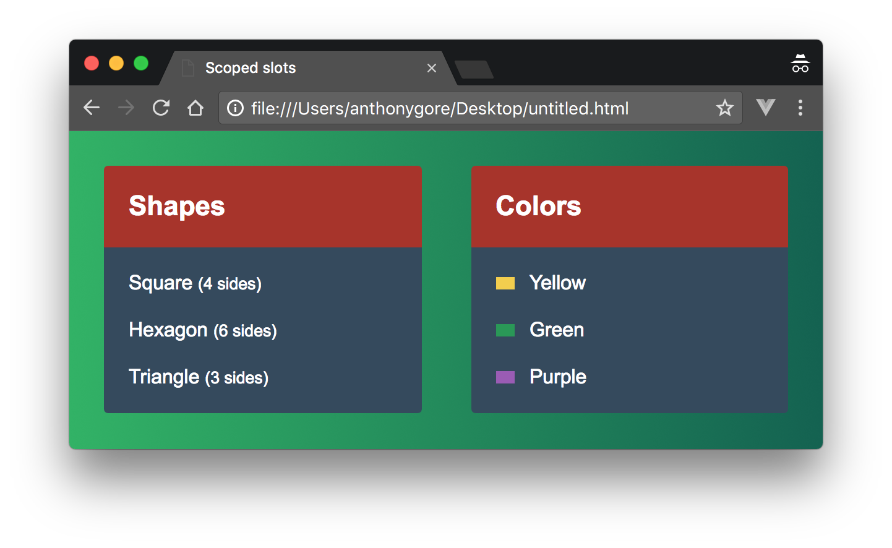

Scoped slots are a useful feature of Vue.js that can make components more versatile and reusable. The only problem is they're difficult to understand! Trying to get your head around the interweaving of parent and child scopes is like solving a tough math equation.

A good approach when you can't understand something easily is to try put it to use in solving a problem. In this article, I'll demonstrate how I used scoped slots to build a reusable list component.



> Note: You can see the finished product in [this Codepen](https://codepen.io/anthonygore/pen/zExPZX).

> *Note: this article was originally posted [here on the Vue.js Developers blog](https://vuejsdevelopers.com/2017/10/02/vue-js-scoped-slots/?jsdojo_id=cjs_vss) on 2017/10/02*

## The basic component

The component we're going to build is called `my-list` and it displays lists of things. The special feature is that you can customize how the list items are rendered in every usage of the component.

Let's tackle the simplest use case first, and get `my-list` to render just one list of things: an array of geometric shape names and the number of sides they have.

*app.js*

```js
Vue.component('my-list', {
  template: '#my-list',
  data() {
    return {
      title: 'Shapes',
      shapes: [ 
        { name: 'Square', sides: 4 }, 
        { name: 'Hexagon', sides: 6 }, 
        { name: 'Triangle', sides: 3 }
      ]
    };
  }
});

new Vue({
  el: '#app'
});
```

*index.html*

```html
<div id="app">
  <my-list></my-list>
</div>

<script type="text/x-template" id="my-list">
  <div class="my-list">
    <div class="title">{{ title }}</div>
    <div class="list">
      <div class="list-item" v-for="shape in shapes">
        <div>{{ shape.name }} <small>({{ shape.sides }} sides)</small></div>
      </div>
    </div>
  </div>
</script>
```

With a bit of CSS added, that will look the following:


## Generalizing `my-list`

Now we want to make `my-list` versatile enough to render any kind of list. The second test case will be a list of colors, including a small swatch to show what the color looks like.

To do this, we'll have to abstract any data specific to the shapes list. Since the items in our lists may be structured differently, we'll give `my-list` a slot so the parent can define how any particular list will display.

*app.js*

```js
Vue.component('my-list', {
  template: '#my-list',
  props: [ 'title' ]
});
```

*index.html*

```html
<script type="text/x-template" id="my-list">
  <div class="my-list">
    <div class="title">{{ title }}</div>
    <div class="list">
      <slot></slot>
    </div>
  </div>
</script>
```

Let's now create two instances of the `my-list` component in the root instance to display our two test case lists:

*app.js*

```js
new Vue({
  el: '#app',
  data: {
    shapes: [ 
      { name: 'Square', sides: 4 }, 
      { name: 'Hexagon', sides: 6 }, 
      { name: 'Triangle', sides: 3 }
    ],
    colors: [
      { name: 'Yellow', hex: '#F4D03F', },
      { name: 'Green', hex: '#229954' },
      { name: 'Purple', hex: '#9B59B6' }
    ]
  }
});
```

```html
<div id="app">
  <my-list :title="Shapes">
    <div class="list-item" v-for="item in shapes">
      <div>{{ shape.name }} <small>({{ shape.sides }} sides)</small></div>
    </div>
  </my-list>
  <my-list :title="Colors">
    <div class="list-item" v-for="color in colors">
      <div>
        <div class="swatch" :style="{ background: color.hex }"></div>
        {{ color.name }}
      </div>
    </div>
  </my-list>
</div>
```

That will look like this:


## Superficial components

What we've just created works fine, but is not great code. `my-list` is, by name, a component for displaying a list. But we've had to abstract all the logic for rendering the list into the parent. The component does little more than wrap the list with some presentational markup.

Given that there's still repeated code in both declarations of the component (i.e. `<div class="list-item" v-for="item in ...">`), it'd be great if we could delegate this to the component so it isn't so superficial.

## Scoped slots

To allow us to do this, we'll use a *scoped slot* instead of a regular slot. Scoped slots allow you to pass a *template* to the slot instead of passing a rendered element. It's called a "scoped" slot because although the template is rendered in the parent scope, it will have access to certain child data.

For example, a component `child` with a scoped slot might look like the following.

```html
<div>
  <slot my-prop="Hello from child"></slot>
</div>
```

A parent that uses this component will declare a `template` element in the slot. This template element will have an attribute `scope` that names an alias object. Any props added to the slot (in the child's template) are available as properties of the alias object.

```html
<child>
  <template scope="props">
    <span>Hello from parent</span>
    <span>{{ props.my-prop }}</span>
  </template>
</child>
```

Renders as:

```html
<div>
  <span>Hello from parent</span>
  <span>Hello from child</span>
</div>
```

## Using a scoped slot in `my-list`

Let's pass the list arrays to `my-list` as props. Then we can replace the slot with a scoped slot. That way `my-list` can be responsible for iterating the list items, but the parent can still define how each list item should display.

*index.html*

```html
<div id="app">
  <my-list title="Shapes" :items="shapes">
    <!--template will go here-->
  </my-list>
  <my-list title="Colors" :items="colors">
    <!--template will go here-->
  </my-list>   
</div>
```

Now we get `my-list` to iterate the items. Inside the `v-for` loop, `item` is an alias to the current list item. We can create a slot and bind that list item to the slot using `v-bind="item"`.

*app.js*

```js
Vue.component('my-list', {
  template: '#my-list',
  props: [ 'title', 'items' ]
});
```

*index.html*

```html
<script type="text/x-template" id="my-list">
  <div class="my-list">
    <div class="title">{{ title }}</div>
    <div class="list">
      <div v-for="item in items">
        <slot v-bind="item"></slot>
      </div>
    </div>
  </div>
</script>
```

> Note: if you haven't seen `v-bind` used without an argument before, this will bind the properties of an entire object to the element. This is useful with scoped slots as often the objects you bind will have arbitrary properties which now don't need to be specified by name.

Now we'll return to our root instance and declare a template within the slot of `my-list`. Looking at the shapes list first, the template must include the `scope` property to which we assign an alias `shape`. This alias allows us to access the scoped props. Inside the template, we can use exactly the same markup we had before to display our shape list items. 

```html
<my-list title="Shapes" :items="shapes">
  <template scope="shape">
    <div>{{ shape.name }} <small>({{ shape.sides }} sides)</small></div>
  </template>
</my-list>
```

Now here's the full template:

```html
<div id="app">
  <my-list title="Shapes" :items="shapes">
    <template scope="shape">
      <div>{{ shape.name }} <small>({{ shape.sides }} sides)</small></div>
    </template>
  </my-list>
  <my-list title="Colors" :items="colors">
    <template scope="color">
      <div>
        <div class="swatch" :style="{ background: color.hex }"></div>
        {{ color.name }}
      </div>
    </template>
  </my-list>   
</div>
```

## Conclusion

Although this approach has just as much markup as before, it has delegated the common functionality to the component which makes for a more robust design.


> *Get the latest Vue.js articles, tutorials and cool projects in your inbox with the [Vue.js Developers Newsletter]( https://vuejsdevelopers.com/newsletter/?jsdojo_id=cjs_vss)*
