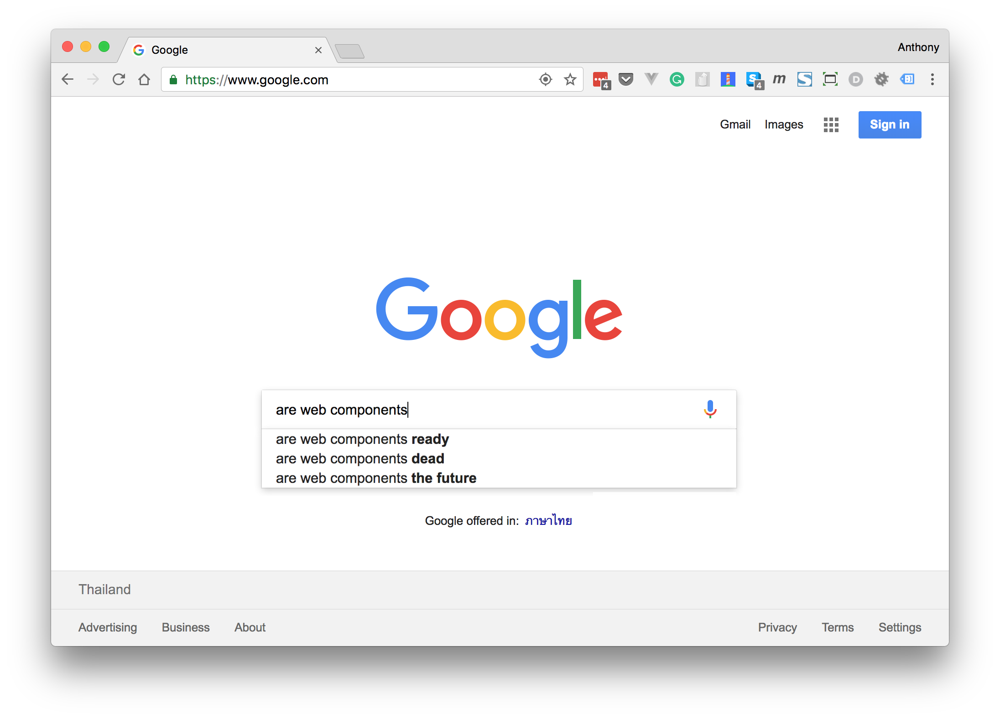
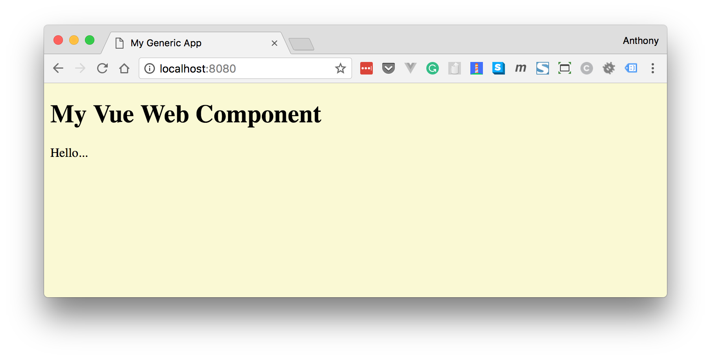
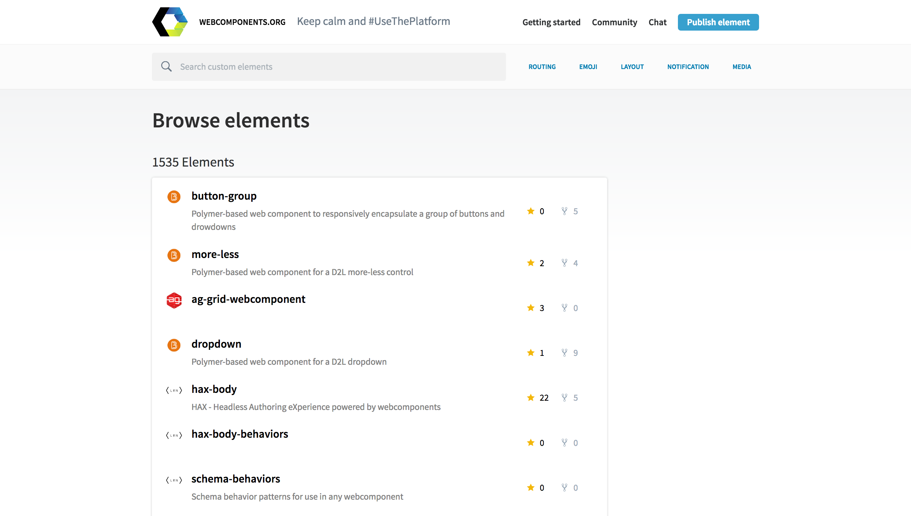

Are web components "the future" for the web platform? There are many opinions both for and against. What is a fact, though, is that browser support is emerging for web components and there are a growing number of tools and resources for authors interested in creating and publishing web components of their own.



A great tool for creating web components is Vue.js, and it's been made even easier with the release of Vue CLI 3 and the new [@vue/web-component-wrapper](https://github.com/vuejs/vue-web-component-wrapper) library. 

In this article, I'll discuss the reasons why you might want to create web components and show you how you make your first one with nothing more than a basic knowledge of Vue.

> *Note: this article was originally posted [here on the Vue.js Developers blog](https://vuejsdevelopers.com/2018/05/21/vue-js-web-component/?jsdojo_id=cjs_vwc) on 2018/05/21*

## What are web components?

You're familiar, of course, with HTML elements like divs, spans, tables etc. *Web components* are *custom* HTML elements that can be used and reused in web apps and web pages. 

For example, you might create a custom element called `video-player` so you can provide a reusable video interface that has UI features beyond what's available with the standard HTML 5 `video` element. This element could provide an attribute "src" for the video file and events like "play", "pause" etc, to allow a consumer to programmatically control it:

```html
<div>
  <video-player src="..." onpause="..."></video-player>
</div>
```


This is probably sounding a lot like what regular Vue components can do! The difference is that web components are native to the browser (or at least, will be as the specs are incrementally implemented) and can be used like normal HTML elements can. Regardless of what tools you use to create your web component, you can consume it in React, Angular etc, or even with no framework at all.

```js
function ReactComponent() {
  return(
    <h1>A Vue.js web component used in React!</h1>
    <video-player></video-player>
  );
}
```

## How do you create a web component?

On the inside, web components are made by standard HTML elements that the browser already knows e.g. divs, spans etc. So `video-player` might look like this internally:

```html
<div>
  <video src="..."></video>
  <div class="buttons">
    <button class="play-button"></button>
    <button class="pause-button"></button>
    ...
  </div>
  ...
</div>
```

Web components can include CSS and JavaScript, too. Using new browser standards like Shadow DOM, these aspects are fully encapsulated within your custom component so that a consumer doesn't need to worry about how their CSS might overwrite rules in the web component, for example.

There are, of course, APIs you will use to declare web components natively. But we don't need to know about those right now as we will use Vue as a layer of abstraction.

> For a more in-depth introduction read [Web Components - Introduction](https://www.webcomponents.org/introduction).

## Creating web components with @vue/web-component-wrapper

Creating web components is easy with Vue CLI 3 and the new [@vue/web-component-wrapper
](https://github.com/vuejs/vue-web-component-wrapper) library.

The @vue/web-component-wrapper library provides a wrapper around a Vue component that interfaces it with web component APIs. The wrapper automatically proxies properties, attributes, events, and slots. This means you can write a working web component with nothing more than your knowledge of Vue components! 

> Another great Vue library for creating web components is [vue-custom-element](https://github.com/karol-f/vue-custom-element).

To create a web component, be sure to have Vue CLI 3 installed and create a new project with any environment settings you like:

```bash
$ vue create vue-web-component-project
```

Now create a new Vue component that you want to use as a web component. This component will be compiled by Webpack before publishing, so you can use any JavaScript features for this. We'll just make something really simple as a proof-of-concept, though:

*src/components/VueWebComponent.vue*


```html
<template>
  <div>
    <h1>My Vue Web Component</h1>
    <div>{{ msg }}</div>
  </div>
</template>
<script>
  export default {
    props: ['msg'] 
  }
</script>
```


To prepare a component for wrapping by @vue/web-component-wrapper, make sure your entry file, *src/main.js*, looks like this:

*src/main.js*

```js
import Vue from 'vue';
import wrap from '@vue/web-component-wrapper';
import VueWebComponent from './components/VueWebComponent';

const CustomElement = wrap(Vue, VueWebComponent);

window.customElements.define('my-custom-element', CustomElement);
```

> The API for registering a web component is `customElements.define()`. Note that "custom element" and "web component" are synonymous in this context.

## Build a web component with Vue CLI 3

Vue CLI 3 includes a lot of great new features (check out [this article](https://vuejsdevelopers.com/2018/03/26/vue-cli-3/) for a rundown). One of them is the *CLI Service* which uses Webpack for a variety of tasks including building your app code for production. This can be done with the simple `vue-cli-service build` command. By adding the `--target wc` switch, you can create a bundle that's perfect for building a web component:

```bash
$ vue-cli-service build --target wc --name my-custom-element ./src/main.js
```

Behind the scenes, this will use Webpack to produce a single JavaScript file with everything needed for your web component inlined. When included on a page, this script registers `<my-custom-element>`, which has wrapped the target Vue component using @vue/web-component-wrapper.

## Consuming your Vue web component in a web page

With your component now built, you or anyone else can use it in a non-Vue project without any Vue.js code (although you will need to import the Vue library as this is intentionally not added to the bundle to avoid repetition in the case where you use multiple Vue-based web components). The custom element acts exactly like a native HTML element once you've loaded the script that defines it on the page.

Note that it's essential to include a polyfill since most browsers don't natively support all the web component specs. Here I'm using [webcomponents.js (v1 spec polyfills)](https://github.com/WebComponents/webcomponentsjs).

*index.html*

```html
<!DOCTYPE html>
<html>
  <head>
    <meta charset="utf-8">
    <meta http-equiv="X-UA-Compatible" content="IE=edge">
    <meta name="viewport" content="width=device-width,initial-scale=1.0">
    <title>My Non-Vue App</title>
  </head>
  <body>
    <!--Load Vue-->
    <script src="https://unpkg.com/vue"></script>
    <!--Load the web component polyfill-->
    <script src="https://cdnjs.cloudflare.com/ajax/libs/webcomponentsjs/1.2.0/webcomponents-loader.js"></script>
    <!--Load your custom element-->
    <script src="./my-custom-element.js"></script>
    <!--Use your custom element-->
    <my-custom-element msg="Hello..."></my-custom-element>
  </body>
</html>
```



It works! If you want to use the code I've been referring to as a template, I've put it in a repo [here](https://github.com/anthonygore/vue-web-component).

## Publishing

Finally, if you want to share your web component with the world, there's no better place than [webcomponents.org](https://www.webcomponents.org/). This site features a browsable collection of web components free for download. The showcased components have been built from a variety of frameworks including Vue, Polymer, Angular etc.



## Further reading

- Docs for [@vue/web-component-wrapper](https://github.com/vuejs/vue-web-component-wrapper) 
- Docs for [Vue CLI 3 Build Targets](https://github.com/vuejs/vue-cli/blob/dev/docs/build-targets.md#web-component)
- [Web Components - Introduction](https://www.webcomponents.org/introduction)

> *Get the latest Vue.js articles, tutorials and cool projects in your inbox with the [Vue.js Developers Newsletter](https://vuejsdevelopers.com/newsletter/?jsdojo_id=cjs_vwc)*
