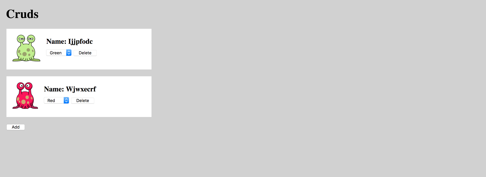

CRUD (Create, Read, Update and Delete) are the basic operations of data storage, and one of the first things you learn as a Laravel developer.

But what happens when you add a Vue.js single-page app as the frontend to this the stack? Suddenly you have to deal with *asynchronous* CRUD, since operations now occur without a page refresh. This will require special attention to ensuring the state of the data is consistent in both the front end backends.

In this tutorial, I'll show you how to set up a full-stack Vue & Laravel app and demo each of the CRUD operations. AJAX is the key to this architecture, so we'll use Axios as the HTTP client. I'll also show you some strategies for dealing with the UX pitfalls of this architecture.

You can check out the finished product in [this GitHub repo](https://github.com/anthonygore/vue-laravel-crud).

> *Note: this article was originally posted [here on the Vue.js Developers blog](https://vuejsdevelopers.com/2018/02/05/vue-laravel-crud/?jsdojo_id=cjs_crd) on 2018/02/05*

## Demo app

The demo full-stack app allows a user to create new "Cruds", which I decided, after an incredible amount of creative thinking, are alien creatures with strange names and the ability to change from red to green and back.

The Cruds are shown on the main page, and the user has the power to create new Cruds, to delete them, or to update their color.


## CRUD in the Laravel backend

We'll begin the tutorial with the Laravel backend where the CRUD operations are fulfilled. I'll keep this part brief as Laravel CRUD is a topic covered extensively elsewhere.

In summary, we will:

- Set up a database
- Set up RESTful API routes by using a Resource Controller
- Define methods in the controller to perform the CRUD operations

### Database

Firstly, the migration. Our Cruds have two properties: a name, and color which we store as text.


*2018_02_02_081739_create_cruds_table.php*

```php
<?php

...

class CreateCrudsTable extends Migration
{
  public function up()
  {
    Schema::create('cruds', function (Blueprint $table) {
      $table->increments('id');
      $table->text('name');
      $table->text('color');
      $table->timestamps();
    });
  }

  ...
}
...
```

### API

Now we set up RESTful API routes. The `resource` method of the `Route` facade will create all the actions we need automatically. However, we don't need `edit`, `show` or `store` so we'll exclude those.

*routes/api.web*

```php
<?php

Route::resource('/cruds', 'CrudsController', [
  'except' => ['edit', 'show', 'store']
]);
```

With this in place, here are the various endpoints we'll now have available in our API:

| Verb | Path | Action | Route Name |
| - | - | - | - |
| GET | /api/cruds | index | cruds.index |
| GET | /api/cruds/create | create | cruds.create |
| PUT | /api/cruds/{id} | update | cruds.update |
| DELETE | /api/cruds/{id} | destroy | cruds.destroy |

### Controller

We now need to implement those actions in the controller:

*app/Http/Controllers/CrudsController*

```php
<?php

namespace App\Http\Controllers;

use App\Crud;
use Illuminate\Http\Request;
use Illuminate\Http\Response;
use Faker\Generator;

class CrudsController extends Controller
{
  // Methods
}
```

Let's do a brief overview of each method:

**create**. We randomize the name and color of a new Crud using the `Faker` package included with Laravel. We send the new Crud data back as JSON.

```php
<?php

...

public function create(Generator $faker)
{
  $crud = new Crud();
  $crud->name = $faker->lexify('????????');
  $crud->color = $faker->boolean ? 'red' : 'green';
  $crud->save();

  return response($crud->jsonSerialize(), Response::HTTP_CREATED);
}
```

**index**. We return the full set of Cruds with the `index` method. In a more serious app we'd use pagination, but let's keep it simple for now.

```php
<?php

...

public function index()
{
  return response(Crud::all()->jsonSerialize(), Response::HTTP_OK);
}
```

**update**. This action allows a client to change the color of a Crud.

```php
<?php

...

public function update(Request $request, $id)
{
  $crud = Crud::findOrFail($id);
  $crud->color = $request->color;
  $crud->save();

  return response(null, Response::HTTP_OK);
}
```

**destroy**. This is how we delete our Cruds.

```php
<?php

...

public function destroy($id)
{
  Crud::destroy($id);

  return response(null, Response::HTTP_OK);
}
```

## Vue.js app

Now for our Vue single-page app. We'll begin by creating a single-file component to represent our Cruds called `CrudComponent.vue`.


This component is just for display and doesn't have much logic. Here are the noteworthy aspects:

- The image shown depends on the color of the Crud (either *red.png* or *green.png*)
- Has a delete button which triggers a method `del` on click, which emits an event `delete` with the ID of the Crud
- Has an HTML select (for choosing the color) which triggers a method `update` on change, which emits an event `update` with the ID of the Crud and the new color selected

*resources/assets/js/components/CrudComponent.vue*


```html
<template>
  <div class="crud">
    <div class="col-1">
      
    </div>
    <div class="col-2">
      <h3>Name: {{ name | properCase }}</h3>
      <select @change="update">
        <option
          v-for="col in [ 'red', 'green' ]"
          :value="col"
          :key="col"
          :selected="col === color ? 'selected' : ''"
        >{{ col | properCase }}</option>
      </select>
      <button @click="del">Delete</button>
    </div>
  </div>
</template>
<script>
  export default {
    computed: {
      image() {
        return `/images/${this.color}.png`;
      }
    },
    methods: {
      update(val) {
        this.$emit('update', this.id, val.target.selectedOptions[0].value);
      },
      del() {
        this.$emit('delete', this.id);
      }
    },
    props: ['id', 'color', 'name'],
    filters: {
      properCase(string) {
        return string.charAt(0).toUpperCase() + string.slice(1);
      }
    }
  }
</script>
<style>...</style>
```


The other component in this project is *App.js*. This is where all the interesting logic occurs so we're going to go through this one step-by-step.

Let's begin with the template. This has the following jobs:

- Display our Cruds with the `crud-component` component discussed above
- Loop through an array of Crud objects (in the array `cruds`), with each mapping to an instance of `crud-component`. We pass all the properties of a Crud through to the component as props, and set up listeners for the `update` and `delete` events coming from the component
- We also have an *Add* button that will create new Cruds by triggering a method `create` on click

*resources/assets/js/components/App.vue*

```html
<template>
  <div id="app">
    <div class="heading">
      <h1>Cruds</h1>
    </div>
    <crud-component
      v-for="crud in cruds"
      v-bind="crud"
      :key="crud.id"
      @update="update"
      @delete="del"
    ></crud-component>
    <div>
      <button @click="create()">Add</button>
    </div>
  </div>
</template>
```

Here's the `script` from *App.js*. Let's talk this out too:

- We start with a function `Crud` that creates new objects used to represent our Cruds. Each has an ID, color, and name
- We import the adjacent `CrudComponent`
- The component definition contains the array `cruds` as a data property. I've also stubbed methods for each CRUD operation which will be populated in the next section

*resources/assets/js/components/App.vue*

```html
<template>...</template>
<script>
  function Crud({ id, color, name}) {
    this.id = id;
    this.color = color;
    this.name = name;
  }

  import CrudComponent from './CrudComponent.vue';

  export default {
    data() {
      return {
        cruds: []
      }
    },
    methods: {
      create() {
        // To do
      },
      read() {
        // To do
      },
      update(id, color) {
        // To do
      },
      del(id) {
        // To do
      }
    },
    components: {
      CrudComponent
    }
  }
</script>
```

## Triggering CRUD from the frontend with AJAX

All the CRUD operations in a full-stack app will be executed in the backend since that's where the database is. However, the triggering of CRUD operations will often happen in the frontend.

As such, an HTTP client (something that can communicate between our front and backends across the internet) will be of importance here. *Axios* is a great HTTP client that comes pre-installed with the default Laravel frontend.

Let's look at our resource table again, as each AJAX call will need to target a relevant API endpoint:

| Verb | Path | Action | Route Name |
| - | - | - | - |
| GET | /api/cruds | index | cruds.index |
| GET | /api/cruds/create | create | cruds.create |
| PUT | /api/cruds/{id} | update | cruds.update |
| DELETE | /api/cruds/{id} | destroy | cruds.destroy |

### Read

Let's begin with the `read` method. This method is responsible for retrieving our Cruds from the backend and will target the `index` action of our Laravel controller, thus using the GET endpoint */api/cruds*.

We can set up a GET call with `window.axios.get`, as the Axios library has been aliased as a property of the `window` object in the default Laravel frontend setup.

Axios methods like `get`, `post` etc return a promise. We chain a `then` method with a callback to access the response. The object resolved can be destructured to allow convenient access to the `data` property in the callback, which is the body of the AJAX response.

*resources/assets/js/components/App.vue*

```js
...

methods() {
  read() {
    window.axios.get('/api/cruds').then(({ data }) => {
      // console.log(data)
    });
  },
  ...
}

/*
Sample response:

[
  {
    "id": 0,
    "name": "ijjpfodc",
    "color": "green",
    "created_at": "2018-02-02 09:15:24",
    "updated_at": "2018-02-02 09:24:12"
  },
  {
    "id": 1,
    "name": "wjwxecrf",
    "color": "red",
    "created_at": "2018-02-03 09:26:31",
    "updated_at": "2018-02-03 09:26:31"
  }
]
*/
```

As you can see, the Cruds are returned in a JSON array. Axios automatically parses the JSON and gives us JavaScript objects, which is nice. Let's iterate through these in the callback, then create new Cruds with our `Crud` factory function, then push them to the `cruds` array data property i.e. `this.cruds.push(...)`.

*resources/assets/js/components/App.vue*

```js
...

methods() {
  read() {
    window.axios.get('/api/cruds').then(({ data }) => {
      data.forEach(crud => {
        this.cruds.push(new Crud(crud));
      });
    });
  },
},
...
created() {
  this.read();
}


```

> Note: We need to trigger the `read` method programmatically when the app loads. We do this from the `created` hook, which works, but is not very efficient. It'd be far better to get rid of the `read` method altogether and just include the initial state of the app inlined into the document head when the first loads. I discuss this design pattern in depth in the article [Avoid This Common Anti-Pattern In Full-Stack Vue/Laravel Apps](https://vuejsdevelopers.com/2017/08/06/vue-js-laravel-full-stack-ajax/) if you want to implement it.

With that done, we can now see the Cruds displayed in our app when we load it:



### Update (and syncing state)

The `update` action requires us to send form data, i.e. `color`, so the controller knows what to update. The ID of the Crud is given in the endpoint.

This is a good time to discuss an issue I mentioned at the beginning of the article: with full-stack apps, you must ensure the state of the data is consistent in both the front and backends.

In the case of the `update` method, we could update the Crud object in the frontend app instantly before the AJAX call is made, since we already know the new state. 

However, we don't perform this update until the AJAX call completes. Why? The reason is that the action might fail for some reason: the internet connection might drop, the updated value may be rejected by the database, or some other reason. 

If we wait until the server responds before updating the frontend state, we can be sure the action was successful and the front and backend data is synchronized. 

*resources/assets/js/components/App.vue*

```js
methods: {
  read() {
    ...
  },
  update(id, color) {
    window.axios.put(`/api/cruds/${id}`, { color }).then(() => {
      // Once AJAX resolves we can update the Crud with the new color
      this.cruds.find(crud => crud.id === id).color = color;
    });
  },
  ...
}
```

> You might argue its bad UX to wait for the AJAX to resolve before showing the changed data when you don't have to, but I think it's much worse UX to mislead the user into thinking a change is done, when in fact, we aren't sure if it is done or not.

### Create and Delete

Now that you understand the key points of the architecture, you will be able to understand these last two operations without my commentary:

*resources/assets/js/components/App.vue*

```js
methods: {
  read() {
    ...
  },
  update(id, color) {
    ...
  },
  create() {
    window.axios.get('/api/cruds/create').then(({ data }) => {
      this.cruds.push(new Crud(data));
    });
  },
  del(id) {
    window.axios.delete(`/api/cruds/${id}`).then(() => {
      let index = this.cruds.findIndex(crud => crud.id === id);
      this.cruds.splice(index, 1);
    });
  }
}
```

## Loading indicator and disabling interaction

As you know, our CRUD operations are asynchronous, and so there's a small delay while we wait for the AJAX call to reach the server, for the server to respond, and to receive the response.

To improve UX it'd be good to have some kind of visual loading indicator, and to disable any interactivity while we wait for the current action to resolve. This lets the user know what's going on, plus, it gives them certainty of the state of the data.

There are some good plugins for Vue.js loading state, but I'm just going to make something quick and dirty here: while AJAX is underway I'll overlay a full screen, semi-transparent `div` over the top of the app. This will kill both the mentioned birds with a single stone.

*resources/views/index.blade.php*

```html
<body>
<div id="mute"></div>
<div id="app"></div>
<script src="js/app.js"></script>
</body>
```

To do this, we'll toggle the value of a boolean `mute` from false to true whenever AJAX is underway, and use this value to show/hide the `div`.

*resources/assets/js/components/App.vue*

```js
export default {
  data() {
    return {
      cruds: [],
      mute: false
    }
  },
  ...
}
```

Here's how we implement the toggling of `mute` in the `update` method. When the method is called, `mute` is set to true. When the promise resolves, AJAX is done so it's safe for the user to interact with the app again, so we set `mute` back to false.

*resources/assets/js/components/App.vue*

```js
update(id, color) {
  this.mute = true;
  window.axios.put(`/api/cruds/${id}`, { color }).then(() => {
    this.cruds.find(crud => crud.id === id).color = color;
    this.mute = false;
  });
},
```

> You'll need to implement the same thing in each of the CRUD methods, but I won't show that here for brevity.

To make our loading indicator markup and CSS, we add the element `<div id="mute"></div>` directly above our mount element `<div id="app"></div>`.

As you can see from the inline style, when the class `on` is added to `<div id="mute">`, it will completely cover the app, adding a greyish tinge and preventing any click events from reaching the buttons and selects:

*resources/views/index.blade.php*


```html
<!doctype html>
<html lang="{{ app()->getLocale() }}">
<head>
  <meta charset="utf-8">
  <meta http-equiv="X-UA-Compatible" content="IE=edge">
  <meta name="viewport" content="width=device-width, initial-scale=1">
  <meta name="csrf-token" content="{{ csrf_token() }}">
  <title>Cruds</title>
  <style>
    html, body {
      margin: 0;
      padding: 0;,
      height: 100%;
      width: 100%;
      background-color: #d1d1d1
    }
    #mute {
      position: absolute;
    }
    #mute.on {
      opacity: 0.7;
      z-index: 1000;
      background: white;
      height: 100%;
      width: 100%;
    }
  </style>
</head>
<body>
<div id="mute"></div>
<div id="app"></div>
<script src="js/app.js"></script>
</body>
</html>
```


The last piece of the puzzle is to toggle the `on` class by utilizing a `watch` on the value of `mute`, which calls this method each time `mute` changes:

```js
export default {
  ...
  watch: {
    mute(val) {
      document.getElementById('mute').className = val ? "on" : "";
    }
  }
}
```

With that done, you now have a working full-stack Vue/Laravel CRUD app with a loading indicator. Here it is again in its full glory:


Don't forget to grab the code [in this GitHub repo](https://github.com/anthonygore/vue-laravel-crud) and leave me a comment if you have any thoughts or questions!

> *Get the latest Vue.js articles, tutorials and cool projects in your inbox with the [Vue.js Developers Newsletter](https://vuejsdevelopers.com/newsletter/?jsdojo_id=cjs_crd)*
