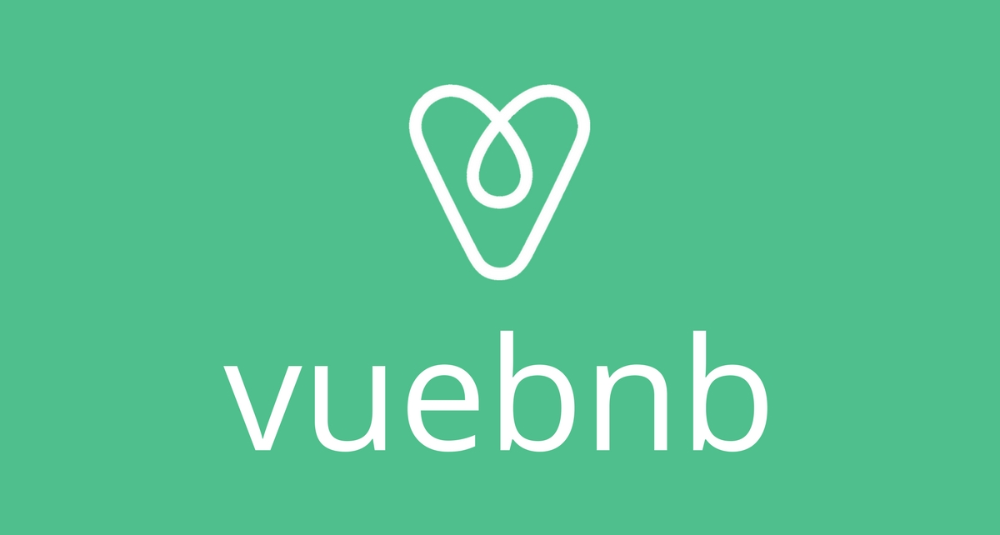
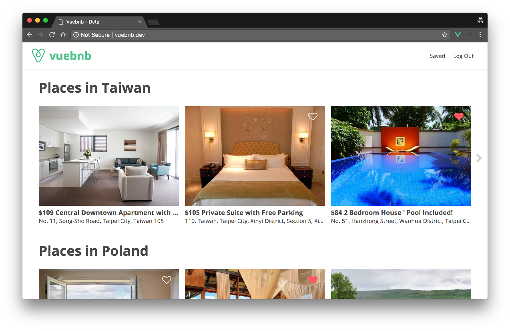
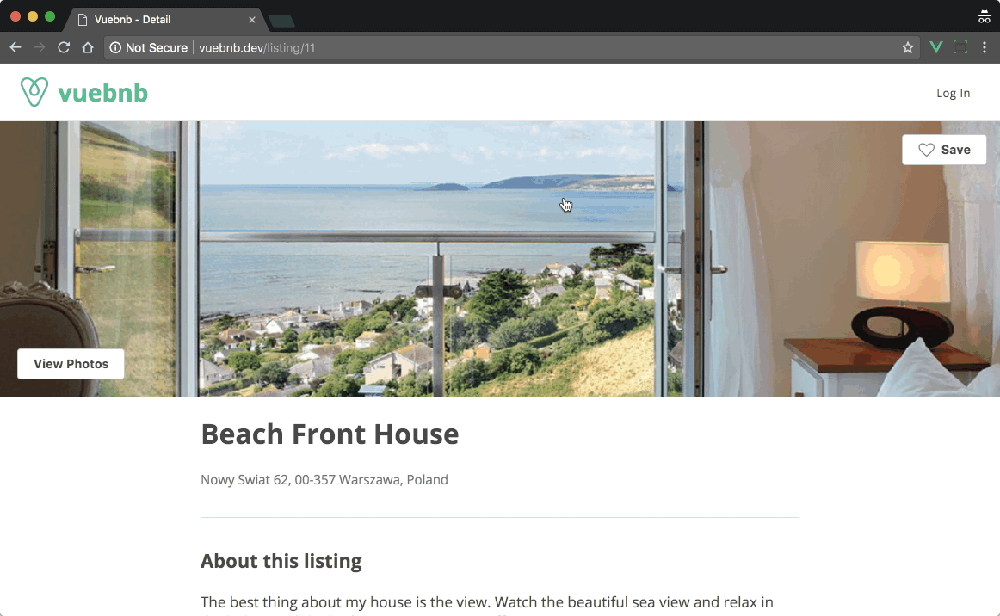
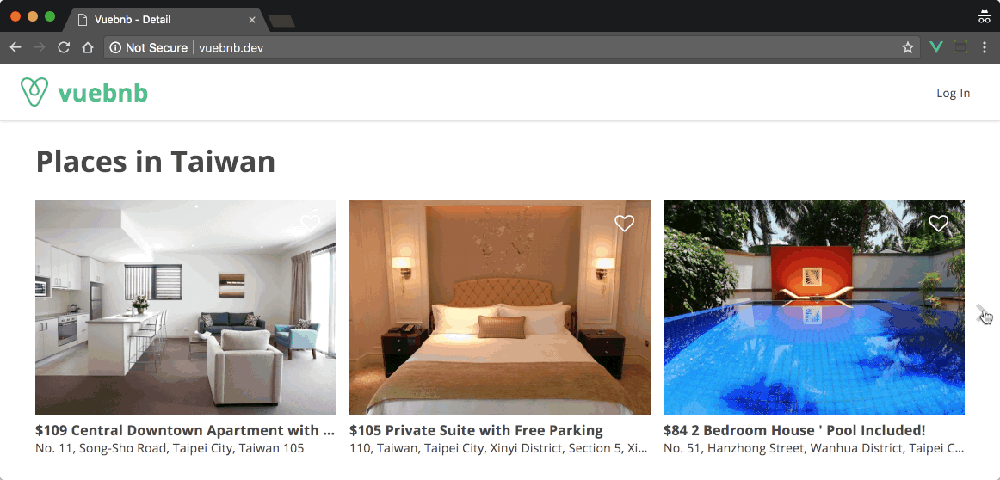
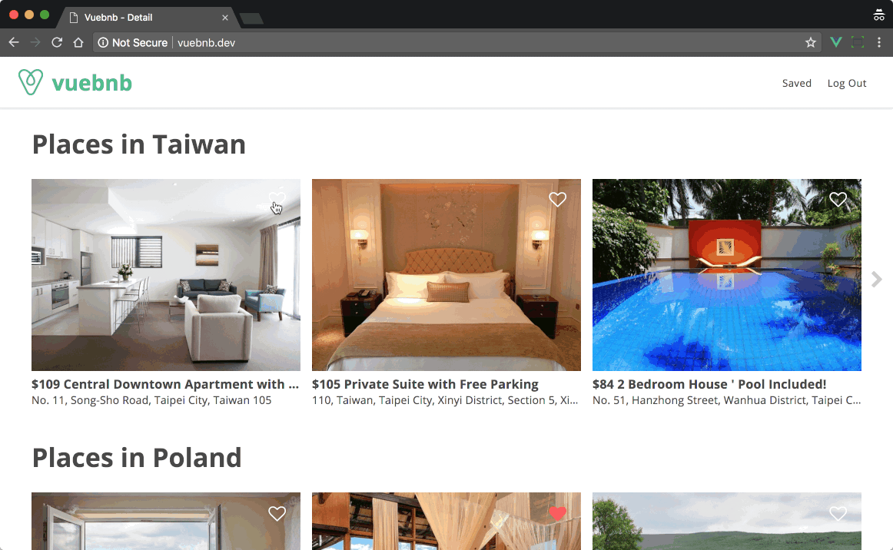
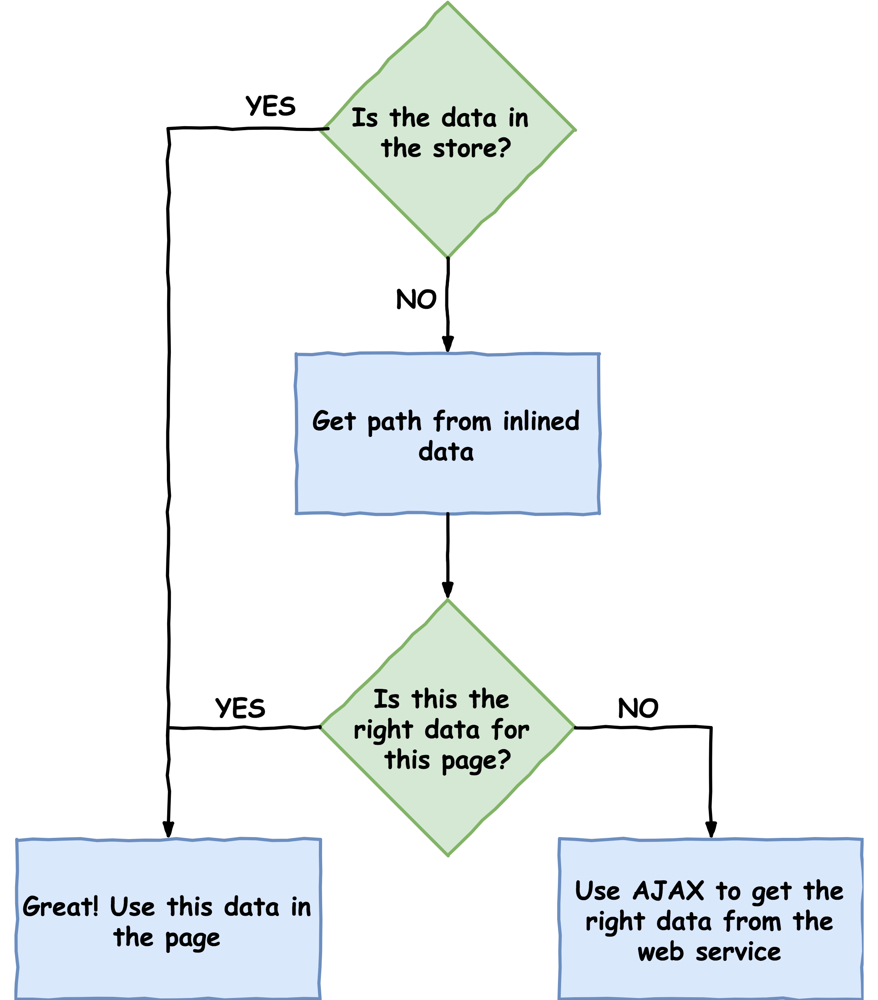

This year I've been writing a new book called *Full-Stack Vue Web Development: Vue.js, Vuex and Laravel*. It'll be published in early 2018 by Packt Publishing.

The book is centred around a case study project, *Vuebnb*, a simple clone of Airbnb. In this post, I'll give a high-level overview of how it works so you get a sense of what's involved in building a full-stack Vue/Laravel app from scratch.

Here's a live demo if you'd like to check it out: [https://vuebnb.vuejsdevelopers.com](https://vuebnb.vuejsdevelopers.com)

> *Note: this article was originally posted [here on the Vue.js Developers blog](https://vuejsdevelopers.com/2017/11/20/vuebnb-full-stack-laravel/?jsdojo_id=cjs_vbb) on 2017/11/20*

## Overview

As a full-stack app, Vuebnb consists of two distinct parts: 

1. The front-end application, built with Vue.js. I also used Vue Router to create the pages and Vuex for managing global state. The code was initially written in a browser script file, but as the complexity increased a Webpack build-step was required to allow for single-file components and ES+ features.

1. The back-end application, built with Laravel. Its main job is to serve the front-end app and its assets and also to provide a web service for the listing data. In combination with Vue Router, the web service allows Vuebnb to act like a single-page app. I also used Laravel Passport for authenticating API calls, which is needed for users to be able to save their favorite room listings.

## Features

The main features of this project include the UI widgets as well as the general architecture of the app. Let's do a brief overview:

### Modal window

The modal window on the listing page lets a user peruse photos of the property to get a better feel for what it offers. 

Modal windows are tricky to implement because they are outside the hierarchy of page elements, making them difficult to communicate with. I handle this by using Vue.js features like component refs and lifecycle hooks to manage body classes.

### Image slider

The image slider on the home page makes it convenient to see all the available listings. A CSS `transform: translate(..)` is used to move the images side-to-side, while a transition gives the sliding effect. I use Vue.js to bind the value of the translate with the left- and right-arrow controls. 

Building this widget takes a good understanding of components, props and events and is, therefore, the main task of chapter 6 of the book, *Composing Widgets With Vue.js Components*.

### Favoriting listings

A user may want to make a note of listings they like so I added a "favoriting" feature. A listing can be favorited from either the home page or the listing page by clicking the *heart* icon, which is part of a reusable component.

I've stored the favorited-state of a listing in a Vuex store so it can be persisted across pages. To persist the state across sessions, I send it via AJAX back to the server where it is stored in the database. Laravel Passport is used to authenticate the API calls.

### Sharing data between the back and front ends

One of the key considerations of full-stack apps is how to communicate data between the back and front ends, so I spend considerable time dealing with this in the book. 

For example, how does the data for a listing get from Laravel to a page within Vue.js? By using Blade views it's easy to inject data into the head of the page using template variables. This data can then be retrieved from the Vue app when it initializes. 

But if Vue Router is used to create virtual pages, how is subsequent page data retrieved? The solution involves a synergy of Blade, Vue Router, Vuex and Axios to create a surprisingly simple mechanism for retrieving data when and where it's needed.

## About the book

From looking at features of Vuebnb you will have a sense of some the topics covered in *Full Stack Vue Web Development: Vue.js, Vuex and Laravel*. Other topics I didn't mention in this article include:

- The core concepts of Vue.js like data binding, directives and lifecycle hooks
- Setting up a best-practice development workflow for full-stack Vue/Laravel, including Webpack
- Deploying full-stack app to production with a free Heroku app and a CDN to serve static assets

If you're keen to get the book or find out more, join the *Vue.js Developers Newsletter* as I'll make an announcement there when it is released.

> *Get the latest Vue.js articles, tutorials and cool projects in your inbox with the [Vue.js Developers Newsletter](https://vuejsdevelopers.com/newsletter/?jsdojo_id=cjs_vbb)*
