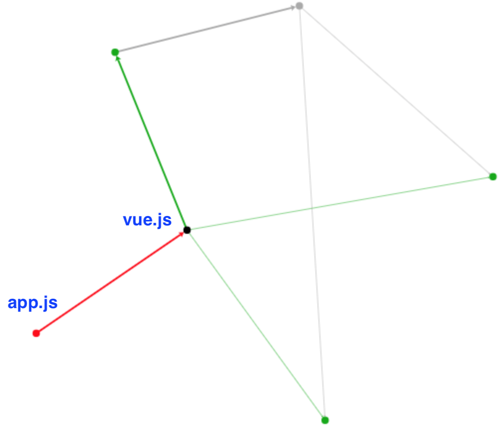
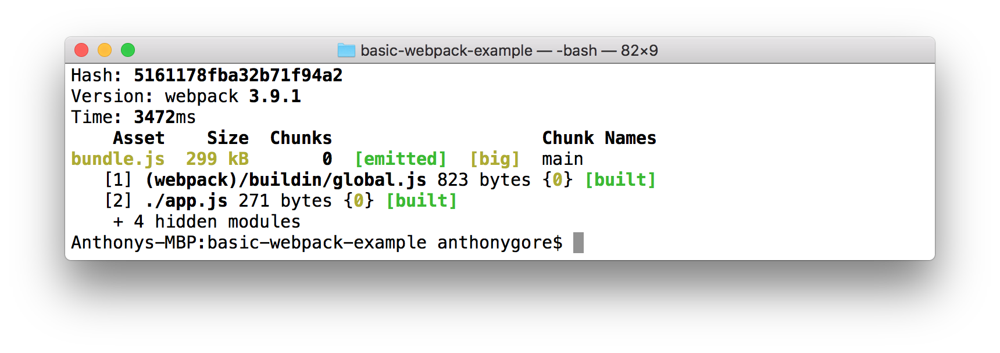

For many developers, Vue.js is the first front-end JavaScript framework they've learnt. If that's true for you, you probably haven't had a reason to learn Webpack yet. But as you continue with Vue, you'll see Webpack popping up over and over again in the documentation, example projects and in relation to tools like Vue CLI.

Webpack promises great things for Vue users: 

- An automated development process that makes coding a breeze
- A world of handy development features like Vue's beloved Single-File Components
- Optimizations for your code to make it fast and lean

But the range of possibilities of Webpack is also why it's so intimidating at first. It appears to do so many things that it's hard to grasp what it really *is*.

The Webpack guides have become increasingly better at explaining Webpack, but a certain amount of background knowledge is still assumed. In this article, I'll attempt to give you that background without the jargon that may otherwise leave you confused.

> *Note: this article was originally posted [here on the Vue.js Developers blog](https://vuejsdevelopers.com/2017/12/04/webpack-intro-vue-js/?jsdojo_id=cjs_jwi) on 2017/12/04*

## Example project

Webpack helps you develop JavaScript applications, so to discuss it we should have a simple example project in mind. The following is what I'll be referring to throughout this article:

*app.js*

```js
const app = new Vue({
  el: '#app',
  data: {
    message: 'Hello World'
  }  
});
```

*index.html*

```html
<!DOCTYPE html>
<html lang="en">
<head>
  <meta charset="utf-8">
  <title>Vue.js Project</title>
</head>
<body>
  <div id="app">{{ message }}</div>
  <script type="text/javascript" src="vue.js"></script>
  <script type="text/javascript" src="app.js"></script>
</body>
</html>
```

## Dependencies


The story of Webpack begins with some observations about how JavaScript dependencies are managed in an HTML document. By "dependencies" I mean third-party libraries like Vue, jQuery or Lodash, or even other script files from your own code base.

In fact, there's no real way of managing dependencies in an HTML document other than to ensure any shared functions and variables have global scope and that scripts are loaded in the right order. 

For example, since *vue.js* defines a global `Vue` object and is loaded first, we're able to use the `Vue` object in our *app.js* script. If either of those conditions was not met, the script would break. Consider the following where we attempt to use `Vue` before it has loaded:

```html
<script>
  console.log(Vue);
  // Uncaught ReferenceError: Vue is not defined
</script>
<script type="text/javascript" src="vue.js"></script>
```

In a complex web application this system is insufficient because:

- Global variables introduce possibilities of naming collisions
- Script loading order is fragile and can be easily broken as the app grows
- Performance optimizations, like loading scripts asynchronously, cannot be utilized

## Modules

A solution to the dependency management problem is to use a *module system* where code is modularized and imported into other scripts. Over the years, there have been several different JavaScript module systems developed, but *ES modules* is the system that is now being incorporated into the JavaScript standard.

Here's a simple ES modules example:

*moduleA.js*

```js
export default function(value) {
  return value * 2;
}
```

*moduleB.js*

```js
import multiplyByTwo from './moduleA';
console.log(multiplyBy2(2));
// 4
```

Could we make Vue.js a module and avoid the problems discussed? Yes! The Vue.js script file that's used directly in a browser is just one of the available builds of Vue. There is also an ES module build named *vue.esm.browser.js* which can be used in our example project like this:

*app.js*

```js
import Vue from './vue.esm.browser.js';

const app = new Vue({
  el: '#app',
  data: {
    message: 'Hello World'
  }  
});
```

Script order isn't a problem now since the compiler knows it has to wait until *vue.esm.browser.js* is available before it can run. Global variables aren't needed either because modules are referenced by their file name.

The problem is that ES modules is not consistently supported in browsers. In fact, until a few months ago, it wasn't supported in *any* browser.

If we want to use ES modules or any other JavaScript module system, we'll need to resolve the code into something that can be reliably used in a browser. Enter Webpack.

## Bundling

Webpack is a Node.js tool that runs offline in your development environment. Webpack is able to resolve
JavaScript modules into browser-friendly code in a process called "bundling".

Bundling begins with an "entry file". Webpack analyzes the entry file to find any dependencies. In the example project, *app.js* is the entry file and has just one dependency, Vue.js. In most projects, there will be many more.

Webpack then analyzes the dependencies to find any dependencies that they might have. This process continues until all dependencies of the project are found. 

The result is a *graph* of dependencies. For the example project, the graph includes *app.js*, *vue.js* and a few other dependencies required by Webpack.



Webpack uses this graph as a blueprint for bundling all the code into a single browser-friendly file. 

In the example project, the bundle file will replace the individual script files *vue.js* and *app.js* in the HTML document:

*index.html*

```html
<!DOCTYPE html>
<html lang="en">
<head>
  <meta charset="utf-8">
  <title>Vue.js Project</title>
</head>
<body>
  <div id="app">{{ message }}</div>
  <script type="text/javascript" src="bundle.js"></script>
</body>
</html>
```

## Loaders

Webpack provides a reliable solution to the JavaScript dependency management problem. From this foundation other powerful emerge e.g. *loaders*. 

Loaders allow Webpack to transform a file before it's bundled. For example, the Webpack Babel loader transforms next-generation JavaScript syntax like ES2015 into standard ES5. This allows developers to write their code using modern features but still provide support in older browsers.

For example, in *app.js* we use the ES2015 `const`, which isn't supported by IE10:

*app.js*

```js
const app = new Vue({
  el: '#app',
  data: {
    message: 'Hello World'
  }  
});
```

If the Webpack Babel loader is used `const` will be transformed to `var` before it's added to the bundle:

*bundle.js*

```js
...

var app = new Vue({
  el: '#app',
  data: {
    message: 'Hello World'
  }  
});

...
```

There are many other loaders including:

- CSS loader
- Sass loader
- Typescript loader
- Vue Loader (for single-file components)

## Running Webpack

Webpack uses a declarative config file to describe each aspect of the build. These config files are notoriously long and difficult to follow, but for a simple project you should be able to get the gist: 

*webpack.config.js*

```js
module.exports = {
  // Entry file
  entry: './app.js',
  output: {
    // Output bundle
    filename: 'bundle.js'
  }, 
  module: {
    rules: [
      {
        // For .js files...
        test: /\.js$/,
        use: {
          // Use the Babel loader
          loader: 'babel-loader'
        }
      }
    ]
  },
  resolve: {
    alias: {
      // Ensure the right Vue build is used
      'vue$': 'vue/dist/vue.esm.js'
    }
  }
};
```

With the config file created, Webpack can then be run with a CLI command:

```bash
$ webpack
```

As Webpack runs, it outputs statistics about the build in the terminal. Many of these stats won't have meaning right now, but you can at least see that this build took about three seconds to complete and the output file, *bundle.js*, is 299KB. 



## Next step

This article hasn't gotten you very far in learning Webpack, but the goal was to give you the background I think is missing from the official docs and other guides.

The big takeaway I hope you've gotten is that *Webpack is first and foremost a module bundler*. All of Webpack's other features emerge from this basic model.

For the next step, I recommend you go through the *Concepts* section of the Webpack Docs:

> https://webpack.js.org/concepts/

Good luck!

> *Get the latest Vue.js articles, tutorials and cool projects in your inbox with the [Vue.js Developers Newsletter](https://vuejsdevelopers.com/newsletter/?jsdojo_id=cjs_jwi)*
